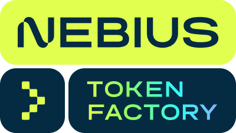
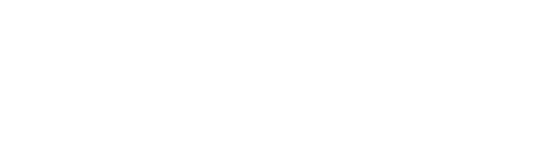
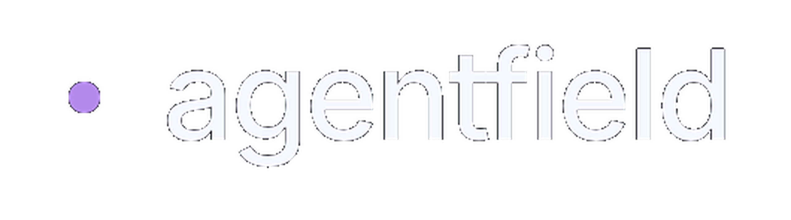

# Awesome AI Apps 

This repository is a comprehensive collection of **70+ practical examples, tutorials, and recipes** for building powerful LLM-powered applications. From simple chatbots to advanced AI agents, these projects serve as a guide for developers working with various AI frameworks and tools.

## 📋 Table of Contents

- [🎓 Courses](#-courses)
- [🚀 Featured AI Apps](#-featured-ai-apps)
  - [🧩 Starter Agents](#-starter-agents)
  - [🪶 Simple Agents](#-simple-agents)
  - [🗂️ MCP Agents](#️-mcp-agents)
  - [🧠 Memory Agents](#-memory-agents)
  - [📚 RAG Applications](#-rag-applications)
  - [🔬 Advanced Agents](#-advanced-agents)
- [📺 Tutorials & Videos](#-tutorials--videos)
- [🚀 Getting Started](#getting-started)
- [🤝 Contributing](#-contributing)

---

## 💎 Sponsors

  A huge thank you to our sponsors for their generous support!

<table align="center" cellpadding="10" style="width:100%; border-collapse:collapse;">
  <tr align="center">
    <td width="300" valign="middle" align="center">
      
       
      
        Web Data Platform
         
        
      
    </td>
    <td width="300" valign="middle" align="center">
      
       
      
        AI Inference Provider
         
        
      
    </td>
    <td width="300" valign="middle" align="center">
      
       
      
        AI Web Scraping framework
         
        
      
    </td>
  </tr>
  <tr align="center">
    <td width="300" valign="middle" align="center">
      
       
      
        SQL Native Memory for AI
         
        
      
    </td>
    <td width="300" valign="middle" align="center">
      
       
      
        Agentic Application Platform
         
        
      
    </td>
    <td width="300" valign="middle" align="center">
      
       
      
        Auth Stack for AI
         
        
      
    </td>
  </tr>
  <tr align="center">
    <td width="200" valign="middle" align="center">
      
       
      
        AI Observability Platform
         
        
      
    </td>
    <td width="200" valign="middle" align="center">
      
       
      
        Google Search API
         
        
      
    </td>
    <td width="200" valign="middle" align="center">
      
       
      
        Kubernetes for AI Agents
         
        
      
    </td>
  </tr>
  <tr align="center">
    <td width="200" valign="middle" align="center">
      
       
      
        Agentic Browser Infrastructure
         
        
      
    </td>
  </tr>
</table>

### 💎 Become a Sponsor

Interested in sponsoring this project? Feel free to reach out!
 
<a href="https://dub.sh/arindam-linkedin" target="_blan