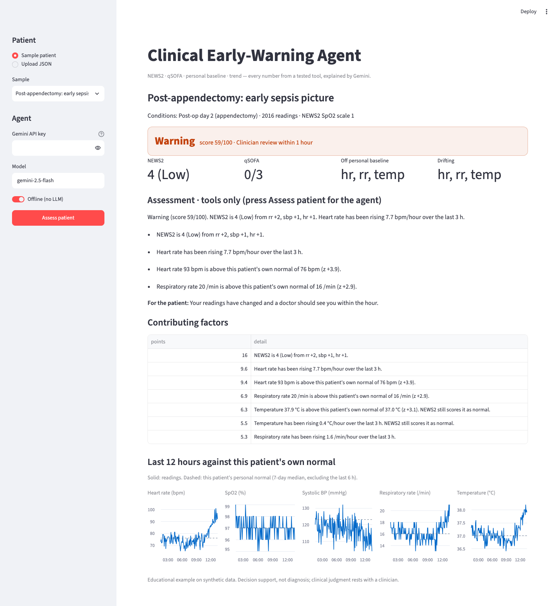
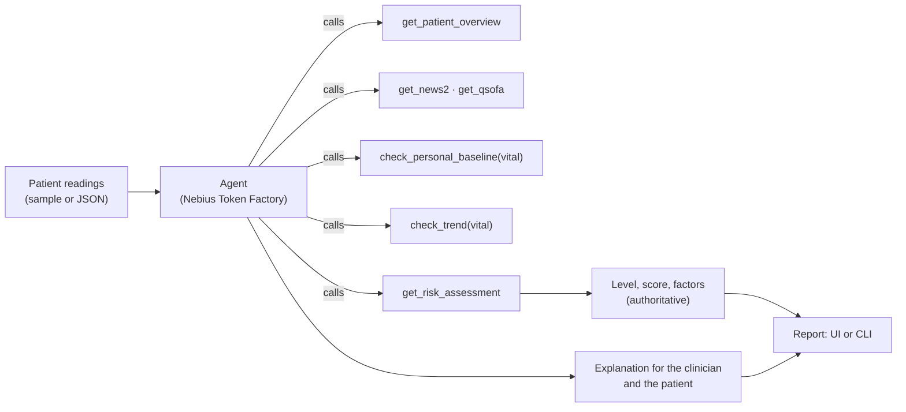

# Clinical Early-Warning Agent

> An agent that reads a patient's vital signs, spots deterioration that fixed-threshold scores miss, and explains it for a clinician — with every number taken from a tested tool, never from the model's guesswork.

A tool-calling agent running an open model on [Nebius Token Factory](https://dub.sh/nebius) through its OpenAI-compatible API. The model plans the review and writes the explanation; deterministic Python tools compute the **NEWS2** early warning score, the **qSOFA** sepsis screen, the patient's **personal baseline** and each vital sign's **trend**. The combined risk level always comes from the tools, so the answer is grounded and auditable.

> ⚠️ Educational example on **synthetic data**. Decision support, not diagnosis; it is not a medical device.

## 🚀 Features

- **NEWS2, exactly as charted**: the Royal College of Physicians' National Early Warning Score 2, including SpO₂ scale 2 for patients with a prescribed 88–92% target (e.g. COPD).
- **qSOFA sepsis screen**: respiratory rate ≥ 22, systolic BP ≤ 100, altered mentation.
- **Personal baseline**: each vital is compared with *this* patient's own normal (7-day median and MAD, excluding the last 6 hours), so a runner whose resting heart rate is 52 is not judged against everyone else.
- **Trend detection**: a 3-hour slope whose standard error is widened for autocorrelation, so a slow slide inside "normal" ranges is caught while noise can't fake a trend.
- **Explainable score**: a 0–100 score and a level (Stable, Watch, Warning, Critical) built from named factors that add up to the score, and never lower than NEWS2 alone would escalate.
- **Grounded agent**: the model calls six tools; if its text names a different level than the tools computed, the tools' level is used and the report says so.
- **Works offline**: with no API key, the same tools run and a template explanation is used.
- **Streamlit UI and CLI**, five synthetic sample patients, and JSON upload for your own data.

## 🛠️ Tech Stack

- **Python 3.10+**: core language
- **[Nebius Token Factory](https://dub.sh/nebius)**: serves the LLM (default `Qwen/Qwen3-30B-A3B-Instruct-2507`) through its OpenAI-compatible API
- **OpenAI Python SDK**: chat completions with function calling, pointed at Token Factory
- **Streamlit + Altair**: web interface and charts
- **pytest**: 80 tests, no API key needed (the agent loop is tested with a fake client)

## Workflow



1. The patient's week of 5-minute readings is loaded into a tool session.
2. The model calls the tools: overview, NEWS2, qSOFA, then personal-baseline and trend checks for the vitals that matter, then the combined risk assessment.
3. It answers in JSON: a 2–3 sentence summary for the clinician, key findings with their numbers, one plain sentence for the patient, and the suggested review urgency.
4. The report shows the level from the tools, the model's explanation, every contributing factor, and the full tool trace.

## 📦 Getting Started

### Prerequisites

- Python 3.10+
- [uv](https://github.com/astral-sh/uv) or pip
- Optional: a [Nebius Token Factory API key](https://dub.sh/nebius) — without one the agent runs offline

### Environment Variables

Copy `.env.example` to `.env`:

```env
NEBIUS_API_KEY="your_nebius_api_key"
NEBIUS_MODEL="Qwen/Qwen3-30B-A3B-Instruct-2507"
```

`NEBIUS_MODEL` can be any model on Token Factory that supports tool calling (for example `meta-llama/Llama-3.3-70B-Instruct` or `Qwen/Qwen3-235B-A22B-Instruct-2507`). `NEBIUS_BASE_URL` overrides the endpoint (default `https://api.tokenfactory.nebius.com/v1/`).

### Installation

1. **Clone the repository:**

   ```bash
   git clone https://github.com/Arindam200/awesome-ai-apps.git
   cd awesome-ai-apps/advance_ai_agents/clinical_early_warning_agent
   ```

2. **Install dependencies:**

   - **Using `uv` (recommended):**
     ```bash
     uv sync --extra test
     ```
   - **Using `pip`:**
     ```bash
     python -m venv .venv
     source .venv/bin/activate  # On Windows: .venv\Scripts\activate
     pip install -r requirements.txt
     ```

## ⚙️ Usage

**Web app:**

```bash
streamlit run app.py
```

Open `http://localhost:8501`, pick a sample patient (or upload JSON), and press **Assess patient**. Until you do, the page shows the tools' own assessment instantly.

**Command line:**

```bash
python main.py --sample early_sepsis             # Nebius model, if NEBIUS_API_KEY is set
python main.py --sample runner --offline         # tools + template explanation, no API call
python main.py --file my_patient.json --json     # your own data, full result as JSON
```

**Sample patients** (all synthetic):

| Sample | What it shows | Result |
|---|---|---|
| `stable` | A quiet post-operative patient | Stable |
| `slow_hypoxia` | SpO₂ sliding ~1%/hour inside ranges NEWS2 still calls near-normal | Watch while NEWS2 is Low |
| `early_sepsis` | Heart rate, temperature and breathing climbing, BP easing down | Warning while NEWS2 is 4 (Low) |
| `runner` | Resting HR 52 rising to 82 — normal to NEWS2, not to this patient | Watch while NEWS2 is 0 |
| `copd` | Living at SpO₂ 90% on a prescribed target | Stable on NEWS2 scale 2 |

**Your own data** — a JSON file of readings (5-minute intervals work best; a personal baseline needs at least ~8 hours of history):

```json
{
  "patient": {"id": "bed-12", "label": "Bed 12", "conditions": ["COPD"], "spo2_scale": 2},
  "readings": [
    {"ts": "2026-01-15T07:55:00Z", "hr": 88, "spo2": 90, "sbp": 128, "rr": 20, "temp": 36.9,
     "on_oxygen": false, "consciousness": "A"}
  ]
}
```

`consciousness` is `A` (alert), `C` (new confusion), `V`, `P` or `U`.

**Tests:**

```bash
uv run pytest        # or: python -m pytest
```

## 📂 Project Structure

```
clinical_early_warning_agent/
├── early_warning/
│   ├── models.py      # Reading, Patient, JSON loading
│   ├── scoring.py     # NEWS2 and qSOFA
│   ├── signals.py     # personal baseline and trend
│   ├── assess.py      # combined, explainable risk level
│   ├── tools.py       # the tools the agent calls (with a trace)
│   ├── agent.py       # tool-calling loop, grounding check, offline fallback
│   ├── samples.py     # deterministic synthetic patients
│   └── report.py      # terminal report
├── tests/             # 80 tests: scores, signals, assessment, agent loop, CLI
├── assets/            # screenshot
├── app.py             # Streamlit UI
├── main.py            # CLI
├── pyproject.toml
├── requirements.txt
└── .env.example
```

## 🩺 How the risk level is built

| Component | Points |
|---|---|
| NEWS2 total × 4 (max 40), +6 if any single parameter scores 3 | from the latest reading |
| qSOFA ≥ 2 | +15 |
| Each vital off its personal baseline (\|z\| ≥ 2.5) | up to 16 per vital (max 35 in total) |
| Each vital drifting (steep and significant 3-hour slope) | up to 14 per vital (max 30 in total) |

Levels: Stable < 25 ≤ Watch < 50 ≤ Warning < 75 ≤ Critical. Escalation floors keep the result at or above what NEWS2 and qSOFA alone demand (NEWS2 ≥ 7 → Critical, NEWS2 5–6 or qSOFA ≥ 2 → Warning, a single NEWS2 parameter at 3 → Watch).

## 🤝 Contributing

Contributions are welcome! Please feel free to submit a Pull Request. See the [CONTRIBUTING.md](https://github.com/Arindam200/awesome-ai-apps/blob/main/CONTRIBUTING.md) for more details.

## 📄 License

This project is licensed under the MIT License - see the [LICENSE](https://github.com/Arindam200/awesome-ai-apps/blob/main/LICENSE) file for details.

## 🙏 Acknowledgments

- [Royal College of Physicians — National Early Warning Score (NEWS) 2](https://www.rcp.ac.uk/improving-care/resources/national-early-warning-score-news-2/)
- Singer M. et al., *The Third International Consensus Definitions for Sepsis and Septic Shock (Sepsis-3)*, JAMA 2016 — qSOFA
- Built by Team AYU (Argonyx'26): the approach comes from our early-warning dashboard, rewritten here as a compact, self-contained agent example.
