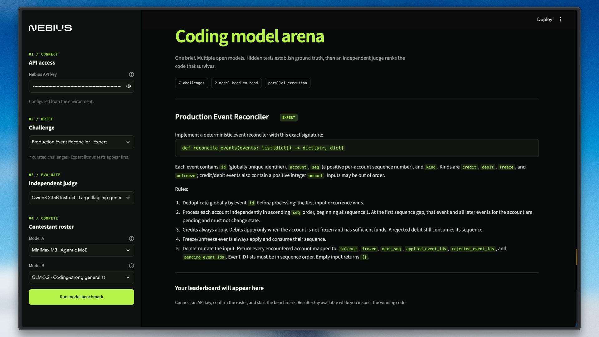

# Coding Model Arena

A professional Streamlit demo for comparing two coding models served by [Nebius Token Factory](https://dub.sh/nebius). Both models receive the same challenge, generate Python solutions in parallel, run against weighted hidden tests, and receive an independent model review.

## How it works

1. Select one of the seven curated coding challenges.
2. Select exactly two contestant models from the live Nebius roster.
3. Select an independent judge model.
4. Run both generations in parallel.
5. Execute each generated solution against local hidden tests.
6. Calculate the final score from 60% hidden-test performance and 40% judge review.

If a model spends its response budget on reasoning and returns no code, the arena retries once with a larger completion budget. An incomplete response is reported as a generation failure and is never presented as a valid zero-point benchmark.
Hybrid GLM and Qwen3.5 contestants run in their supported non-thinking mode so
the completion budget is reserved for the code answer. Every live API request
also has a hard timeout, so a slow or overloaded model becomes an explicit
failure instead of leaving the benchmark running indefinitely.
MiniMax M3 receives a larger completion budget for its native reasoning before
the code answer.

## Challenges

The arena includes seven presets:

- Production Event Reconciler, Expert
- Dependency Rollout Planner, Expert
- Configuration Overlay Engine, Hard
- Two Sum, Easy
- Valid Parentheses, Easy
- LRU Cache, Medium
- Merge Intervals, Medium

The expert challenges use multiple weighted behavioral cases so partially correct implementations can receive partial credit and stronger implementations can separate themselves on the leaderboard.

## Features

- Dark Nebius-branded Streamlit interface
- Exactly two contestants per benchmark
- Live validation against the authenticated Nebius model catalog
- Parallel model generation
- Local subprocess execution with per-challenge hidden tests
- Partial-credit test scoring
- Independent batched judge review
- Generated code and execution diagnostics for each contestant
- Explicit generation, execution, and judge failure states
- Per-model progress updates and bounded live API calls

## Project structure

```text
coding_model_arena/
├── app.py             # Streamlit UI and benchmark orchestration
├── challenges.py      # Challenge prompts and weighted hidden cases
├── execution.py       # Local candidate execution and scoring
├── judge.py           # Independent batched model review
├── models.py          # Nebius contestant and judge roster
├── runner.py          # Code generation, extraction, and retry handling
├── tests/
│   └── test_regressions.py
├── pyproject.toml
└── .env.example
```

## Prerequisites

- Python 3.10 or newer
- A [Nebius Token Factory](https://dub.sh/nebius) API key

## Installation

Run these commands from the repository root:

```bash
cd advance_ai_agents/coding_model_arena
uv sync
cp .env.example .env
```

Set your key in `.env`:

```env
NEBIUS_API_KEY="your_nebius_token_factory_api_key"
SANDBOX_BACKEND="local"
```

## Run the app

From `advance_ai_agents/coding_model_arena`:

```bash
uv run streamlit run app.py
```

The command must be run from this project directory because `app.py` is located here.

## Run the tests

```bash
uv run python -m unittest discover -s tests -v
```

## Security

The local backend executes model-generated Python in a subprocess on the machine hosting Streamlit. This is suitable for a controlled local demo. Do not expose it as a public code-execution service without a hardened isolation backend.

## Contributing

Open an issue before submitting a new project or a significant feature. See the repository [CONTRIBUTING.md](../../CONTRIBUTING.md) for the complete guidelines.

## License

This project is part of the [awesome-llm-apps](https://github.com/Arindam200/awesome-llm-apps) collection and follows the repository license.
