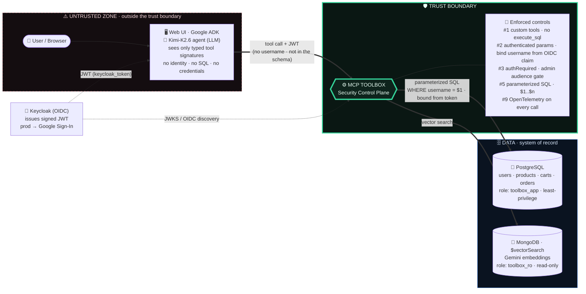

# 🛒 MCP Toolbox Security Agent

> A production-grade reference architecture showing how **MCP Toolbox for Databases** lets an AI agent operate on production databases **without ever being able to over-reach**.

A retail/ecommerce shopping agent that works across **PostgreSQL** and **MongoDB** through a single secure gateway. The agent can search products, manage a cart, and check out — but it **cannot read another user's data, see a database credential, or run raw SQL**. Built with Google ADK, Kimi-K2.6 (via Nebius), and [MCP Toolbox for Databases](https://mcp-toolbox.dev/).

> **Toolbox is the trust boundary.** The agent/LLM lives *outside* it. Every database touch goes through narrow, purpose-built, access-controlled tools.

## 🚀 Features

- **Authenticated parameters** — the agent's tools have **no `username` parameter**; Toolbox binds the caller's identity from a verified OIDC token. The model literally cannot ask for another user's cart or orders.
- **Authorized invocations** — admin tools require a role-driven `grocery-admin` audience that customers can't self-grant.
- **Custom tools, not `execute_sql`** — 8 purpose-built tools, never arbitrary query power.
- **Parameterized queries + least-privilege roles** — SQL injection is treated as a literal; a subverted tool still can't DROP / mutate the catalog / delete orders.
- **Polyglot** — PostgreSQL for transactions + MongoDB `$vectorSearch` (Gemini embeddings) for semantic product discovery, behind one gateway.
- **Web Security Lab** — a UI that runs each control live and shows a `BLOCKED` / `ALLOWED` verdict.
- **Observability** — every tool call is an OpenTelemetry span (Jaeger + Prometheus).
- **One-command verification** — `scripts/verify_security.sh` proves 11 controls.

## 🛠️ Tech Stack

- **Python** — core language
- **MCP Toolbox for Databases 1.4** — the security control plane
- **Google ADK + LiteLLM** — the agent + tool-calling
- **Nebius AI (Kimi-K2.6)** — agent LLM (pluggable → Gemini)
- **Google Gemini** — query embeddings for vector search
- **FastAPI** — web UI + deterministic security-demo endpoints
- **PostgreSQL 16** — transactional system of record
- **MongoDB Atlas Local** — `$vectorSearch`
- **Keycloak (OIDC)** — identity (prod → Google Sign-In)
- **OpenTelemetry + Jaeger** — traces & metrics
- **Docker Compose** (local) · **Kubernetes / GKE** (production reference)

## Workflow



The agent never holds a DB credential and never runs raw SQL. It calls typed tools; Toolbox validates the OIDC token, binds the user's identity into the query, and runs it as a least-privilege role. Another user's data is unreachable by construction.

## 🔐 The security model (the point of this project)

| # | Mechanism | What it stops |
|---|---|---|
| 1 | Custom tools, not `execute_sql` | No arbitrary query power |
| 2 | Authenticated parameters | The model can't request another user's data |
| 3 | Authorized invocations (`authRequired`) | Non-admins can't call admin tools |
| 4 | Bound parameters (SDK) | The model can't choose tenant/region |
| 5 | Parameterized queries | SQL injection |
| 6 | Least-privilege DB roles | A subverted tool can't DROP / mutate / delete |
| 7 | IAM / Workload Identity (GKE) | No DB password in the cluster |
| 8 | Secrets handling | Credentials never reach the model |
| 9 | Observability | Every tool call is audited |
| 10 | Network hardening | Agent can't reach the DB directly |

Full mapping in [`docs/SECURITY.md`](docs/SECURITY.md). Architecture in [`docs/ARCHITECTURE.md`](docs/ARCHITECTURE.md).

## 📦 Getting Started

### Prerequisites

- Docker + Docker Compose
- API keys (optional — the **security demo needs none**):
  - [Nebius AI](https://dub.sh/nebius) — agent chat (Kimi-K2.6)
  - [Google AI](https://aistudio.google.com/) — Gemini embeddings (semantic search only)

### Installation

1. **Clone the repository:**

   ```bash
   git clone https://github.com/Arindam200/awesome-ai-apps.git
   cd awesome-ai-apps/mcp_ai_agents/mcp_toolbox_security_agent
   ```

2. **Configure environment (optional keys):**

   ```bash
   cp deploy/compose/.env.example deploy/compose/.env
   # to enable the agent chat + semantic search, add:
   #   NEBIUS_API_KEY=...     (Kimi-K2.6 chat)
   #   GOOGLE_API_KEY=...     (Gemini embeddings)
   ```

3. **Bring up the stack** (builds, starts, and seeds the catalog — the 67MB embeddings dataset is downloaded automatically on first run):

   ```bash
   scripts/bootstrap_local.sh
   ```

### Usage

Open **http://localhost:8080** and sign in as **alice**, **bob**, or **carol** (passwords `alice123` / `bob123` / `carol123`; carol is admin).

- **Shop** — chat with the agent ("find me chocolate", "add 2 to my cart", checkout), see your cart/orders.
- **Security Lab** — run each control live: the cross-user block, the schema proof (the model's `view_cart()` has no `username`), and admin gating.

### Verify the security controls

```bash
scripts/verify_security.sh    # 11 checks: authenticated params, cross-user block,
                              # admin gating, SQL-injection-as-literal, least-privilege
```

| Service | URL |
|---|---|
| Web UI | http://localhost:8080 |
| Toolbox API | http://localhost:5055 |
| Keycloak | http://localhost:8085 (admin/admin) |
| Jaeger (traces) | http://localhost:16687 |

## 🗺️ Layout

```
toolbox/tools.yaml   the centerpiece — sources, custom tools, auth wired in
db/postgres/         schema, least-privilege roles, seed
agent/               Google ADK agent (Kimi via Nebius; Gemini embeddings)
web/                 FastAPI UI + the Security Lab
auth/keycloak/       OIDC realm (alice/bob/carol)
deploy/compose/      local stack    ·   deploy/k8s/   GKE reference (Workload Identity, NetworkPolicy)
scripts/             bootstrap_local · verify_security · build_catalog
docs/                ARCHITECTURE · SECURITY · RUNBOOK
```

## Production

The same model runs on GKE with stronger primitives — Cloud SQL/AlloyDB via **Workload Identity (no DB password at all)**, `tools.yaml` from a Secret, NetworkPolicy, HPA, and `--telemetry-gcp`. See [`deploy/k8s/`](deploy/k8s/).

---

MCP Toolbox for Databases is an open-source Google project: https://github.com/googleapis/genai-toolbox
