# Technical Architecture — MCP Toolbox E-Commerce Security Demo

The diagram below shows every layer of the system and how **MCP Toolbox acts as
the security control plane** between the untrusted LLM layer and the databases.
Annotated numbers correspond to the ten security mechanisms documented in
[SECURITY.md](SECURITY.md).

```mermaid
flowchart TB
    %% -----------------------------------------------------------------------
    %% Styles
    %% -----------------------------------------------------------------------
    classDef untrusted  fill:#fce8e6,stroke:#d93025,color:#000,font-weight:bold
    classDef boundary   fill:#e6f4ea,stroke:#188038,color:#000,font-weight:bold
    classDef idp        fill:#e8f0fe,stroke:#1a73e8,color:#000
    classDef db         fill:#fef7e0,stroke:#f9ab00,color:#000
    classDef obs        fill:#f3e8fd,stroke:#9334e6,color:#000
    classDef network    fill:#e8eaed,stroke:#5f6368,color:#000

    %% -----------------------------------------------------------------------
    %% Browser
    %% -----------------------------------------------------------------------
    subgraph BROWSER["🌐 Browser"]
        USER("👤 User\n(alice / bob / carol)")
    end

    %% -----------------------------------------------------------------------
    %% Untrusted zone — agent-web
    %% -----------------------------------------------------------------------
    subgraph AGENT_WEB["⚠️  agent-web  (FastAPI + Google ADK)   ← UNTRUSTED ZONE"]
        direction TB
        FASTAPI["FastAPI App\n• /api/login  /api/chat  /api/cart …\n• In-memory session store\n• Sets HttpOnly cookie (sid)"]
        ADK["Google ADK Runner\nLLM: Nebius Kimi-K2.6\n     (or Gemini via AGENT_PROVIDER)"]
        SDK["toolbox-core SDK\n#4 bound_params={store_region}\n#2 auth_token_getters={keycloak: _token_getter}"]
        EMBED["Gemini Embeddings\n(server-side; raw 3072-d vector\nnever exposed to LLM)"]

        FASTAPI -->|"ADK runner\nContextVar token = user JWT"| ADK
        ADK -->|"load_tool() calls"| SDK
        ADK -->|"find_similar_products(query)"| EMBED
    end

    %% -----------------------------------------------------------------------
    %% Keycloak — OIDC IdP
    %% -----------------------------------------------------------------------
    subgraph KEYCLOAK["🔑 Keycloak  (OIDC Identity Provider)"]
        KC["grocery realm\n• users: alice, bob, carol\n• roles: grocery-agent / grocery-admin\n• audience-resolve mapper\n  (carol only → grocery-admin aud)"]
    end

    %% -----------------------------------------------------------------------
    %% MCP Toolbox — Trust Boundary
    %% -----------------------------------------------------------------------
    subgraph TOOLBOX["╔══════════════  MCP TOOLBOX  —  TRUST BOUNDARY  ══════════════╗"]
        direction TB

        TB_TOOLS["#1  Custom Named Tools  (10 total)\nget_product_details · add_to_cart · view_cart\nremove_from_cart · checkout · list_my_orders\nget_order_details · semantic_product_search\nview_all_orders · update_inventory\n\nNo execute_sql — attack surface = tool list only"]

        TB_AUTH["#2 + #3  Auth Services  (JWT Validation)\n• keycloak   → audience: grocery-agent\n• keycloak_admin → audience: grocery-admin\nValidates: signature · issuer · audience · expiry\nvia OIDC /.well-known + JWKS cache\n\n#3  authRequired:[keycloak_admin] on admin tools\n     alice/bob → 401;  carol → 200"]

        TB_PARAMS["#2  Authenticated Parameters\nusername  authServices:[{name:keycloak,\n            field:preferred_username}]\n\n→ LLM tool signature: view_cart() — no username\n→ Forged body {username:'bob'} with alice's token\n   still returns alice's data  (claim wins)"]

        TB_BOUND["#4  SDK Bound Parameters\nstore_region fixed by app layer\nAbsent from model-facing signatures\nModel cannot choose tenant / region"]

        TB_SQL["#5  Parameterized Queries  ($1 … $n)\nAll SQL uses positional placeholders\nNo string interpolation → SQL injection impossible\nTool arguments are values, never SQL fragments"]

        TB_ROLES["#6  Least-Privilege DB Roles\ntoolbox_app:  SELECT products\n              SELECT/INSERT carts + orders\ntoolbox_admin: broader read for reporting\n\nCompromised tool → permission denied on\nUPDATE products / DELETE orders / DROP TABLE"]

        TB_SECRETS["#8  Secrets Handling\ntools.yaml uses \${ENV_VAR} interpolation\nCredentials never in source code\nLocal: .env   GKE: Secret Manager (CSI)"]

        TB_OTEL["#9  Observability / Audit Trail\n--telemetry-otlp → OTel Collector → Jaeger\nEvery tool invocation = traced span\nLocal: Jaeger   GKE: Cloud Trace + Monitoring"]

        TB_NET["#10  Network Hardening\n--allowed-hosts / --allowed-origins\nGKE NetworkPolicy:\n  agent → Toolbox only\n  Toolbox → DB only\n  Agent cannot reach DB directly"]

        TB_IAM["#7  IAM / Workload Identity  (GKE)\ncloud-sql-postgres kind → no password\nKSA → GSA binding via Workload Identity\nNo DB password exists in the cluster"]

        TB_TOOLS --> TB_AUTH
        TB_AUTH --> TB_PARAMS
        TB_PARAMS --> TB_BOUND
        TB_BOUND --> TB_SQL
    end

    %% -----------------------------------------------------------------------
    %% Data layer
    %% -----------------------------------------------------------------------
    subgraph DATA["🗄️  Data Layer"]
        PG[("PostgreSQL\ntoolbox_app role\ntoolbox_admin role\n\nusers · products\ncarts · orders")]
        MONGO[("MongoDB  (Atlas Local)\nVector index on\nGemini embeddings\n$vectorSearch")]
    end

    %% -----------------------------------------------------------------------
    %% Observability
    %% -----------------------------------------------------------------------
    subgraph OBS["📊 Observability"]
        OTEL["OTel Collector\nreceives OTLP spans"]
        JAEGER["Jaeger UI\nTrace viewer"]
        OTEL --> JAEGER
    end

    %% -----------------------------------------------------------------------
    %% Edges
    %% -----------------------------------------------------------------------

    %% Browser ↔ FastAPI
    USER -- "HTTPS\nlogin / chat / cart / orders" --> FASTAPI
    FASTAPI -- "HttpOnly cookie (sid)" --> USER

    %% FastAPI ↔ Keycloak  (server-side password grant)
    FASTAPI -- "password grant\n(server-side only)" --> KC
    KC -- "signed JWT\n(preferred_username · aud · exp)" --> FASTAPI

    %% Keycloak → Toolbox  (JWKS discovery)
    KC -. "OIDC /.well-known\nJWKS endpoint\n(auth validation)" .-> TOOLBOX

    %% agent-web → Toolbox  (tool calls with token)
    SDK -- "HTTP/MCP tool call\nkeycloak_token: <JWT>\n(no username in body)" --> TOOLBOX
    FASTAPI -- "deterministic endpoints\nkeycloak_token: <JWT>" --> TOOLBOX
    EMBED -- "POST /api/tool/semantic_product_search/invoke\nembedding: [3072-d vector]" --> TOOLBOX

    %% Toolbox → DBs
    TOOLBOX -- "parameterized SQL\ntoolbox_app/admin role\n($1 = username from token)" --> PG
    TOOLBOX -- "hardcoded index + field path\n$vectorSearch" --> MONGO

    %% Toolbox → OTel
    TOOLBOX -- "OTLP spans\n(every tool call)" --> OTEL

    %% -----------------------------------------------------------------------
    %% Style assignments
    %% -----------------------------------------------------------------------
    class USER,FASTAPI,ADK,SDK,EMBED untrusted
    class TOOLBOX,TB_TOOLS,TB_AUTH,TB_PARAMS,TB_BOUND,TB_SQL,TB_ROLES,TB_SECRETS,TB_OTEL,TB_NET,TB_IAM boundary
    class KC idp
    class PG,MONGO db
    class OTEL,JAEGER obs
```

---

## Security mechanism quick-reference

| # | Mechanism | Where enforced | What it prevents |
|---|---|---|---|
| 1 | **Custom named tools only** — no `execute_sql` | `tools.yaml` (10 tools) | Arbitrary query power; attack surface = tool list |
| 2 | **Authenticated parameters** — `username` from JWT claim | `tools.yaml` `authServices` | Model requesting another user's data |
| 3 | **Authorized invocations** — `authRequired:[keycloak_admin]` | `tools.yaml` admin tools | Non-admins calling `view_all_orders` / `update_inventory` |
| 4 | **SDK bound parameters** — `store_region` fixed by app | `agent/agent.py` `bound_params` | Model choosing tenant / region |
| 5 | **Parameterized queries** — `$1 … $n` everywhere | `tools.yaml` all SQL stmts | SQL injection |
| 6 | **Least-privilege DB roles** — `toolbox_app` / `toolbox_admin` | `db/postgres/01_roles.sql` | Blast radius of a compromised tool |
| 7 | **IAM / Workload Identity** — `cloud-sql-postgres`, no password | `deploy/k8s/tools.yaml` | DB password in the cluster |
| 8 | **Secrets via env-var interpolation** — `${VAR}` in `tools.yaml` | `tools.yaml` + `.env` / Secret Manager | Credentials in source code |
| 9 | **Full observability** — OTLP on every tool call | `--telemetry-otlp` / `--telemetry-gcp` | Silent misuse; every call is an audited trace |
| 10 | **Network hardening** — `--allowed-hosts`; K8s `NetworkPolicy` | `deploy/k8s/networkpolicy.yaml` | Agent reaching DBs directly; SSRF |

> **Key insight:** Everything to the left of the Toolbox boundary (the LLM,
> its prompt, its tool arguments) is treated as **untrusted input**.
> All enforcement happens *inside* Toolbox and in the database — below the agent,
> making misuse structurally impossible rather than just discouraged.
