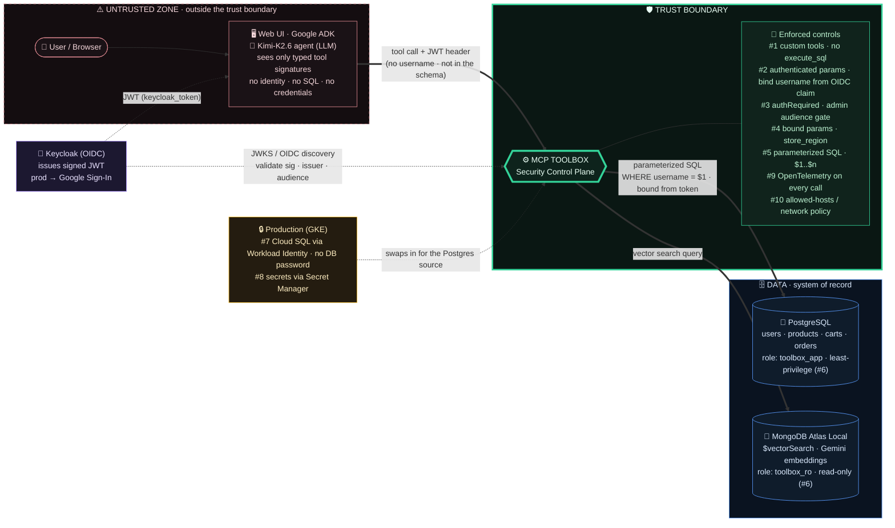

# Technical architecture — MCP Toolbox as the security control plane

## Legend

- **Green (bold)** — MCP Toolbox, the only component that touches data. The agent never holds a DB credential or runs raw SQL.
- **Red dashed** — the untrusted zone: the LLM and its tool arguments. Anything here is treated as hostile.
- **Solid thick arrows** — data-plane calls that Toolbox makes as a least-privilege role.
- **Dotted arrows** — identity/token flow (JWT issuance + OIDC validation).
- **#1–#10** — the ten security mechanisms (full map in [SECURITY.md](SECURITY.md)).

> Renders on GitHub, in [mermaid.live](https://mermaid.live), and VS Code's Mermaid preview.
