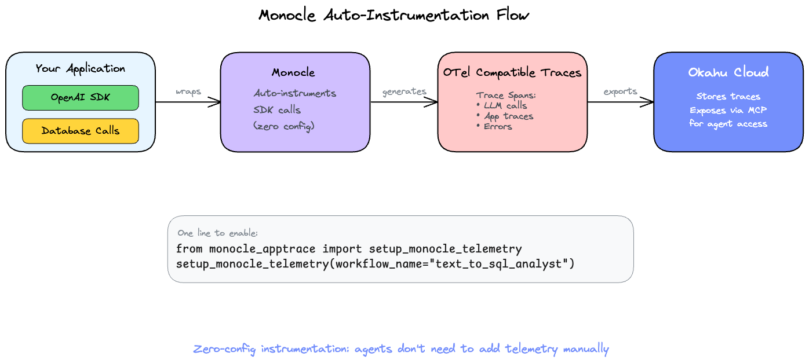
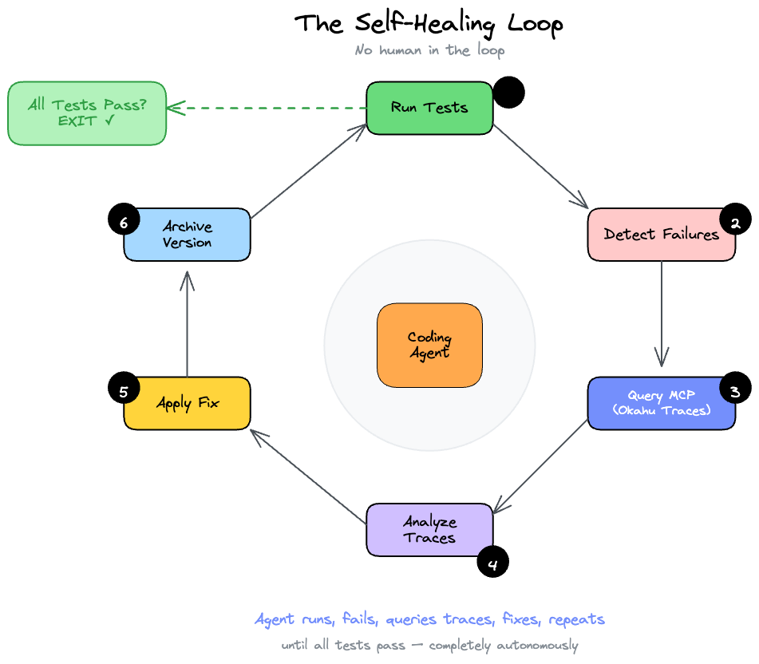

# Telemetry-MCP-Okahu: Self-Healing Agent Demo (GPT-4o)

This Proof-of-Concept demonstrates **autonomous self-healing**: The agent fixes a buggy Text-to-SQL API by analyzing traces from **Okahu Cloud** via the **hosted Okahu MCP**.

Unlike the other POCs where the agent builds from scratch, this one starts with a **pre-built buggy `analyst.py`** that the agent must debug and fix using only trace analysis — no guessing allowed.

_Context: observability evolves so agents can repair systems using platform traces, not only local logs._

> Read full blog "[How to Build Self-Healing AI Agents with Monocle, Okahu MCP and OpenCode](https://dev.to/astrodevil/how-to-build-self-healing-ai-agents-with-monocle-okahu-mcp-and-opencode-1g4e)"

## Core Components

- **Pre-built Buggy `analyst.py`**: Contains intentional bugs for the agent to discover and fix via trace analysis.
- **The @analyst_v3 Agent**: Self-healing agent that uses **Okahu MCP** to analyze traces and fix bugs autonomously.
- **Hosted [Okahu](https://www.okahu.ai) MCP**: Cloud-native trace fetching and analysis (`/okahu:get_latest_traces`).
- **Test Suite**: `test_analyst.py` exposes the bugs through failing tests.

## Prerequisites

- **Python** 3.10 or newer
- **API keys**: OpenAI (or compatible inference), Okahu (telemetry + hosted MCP)
- **OpenCode** CLI with MCP support (for the `@analyst_v3` self-healing flow)

## Project structure

```
telemetry-mcp-okahu/
├── .opencode/agents/     # analyst_v3 agent definition
├── images/               # Diagrams for this README
├── analyst.py            # Buggy Text-to-SQL module (reset via reset_demo.py)
├── boilerplate.py        # Reference patterns for fixes
├── main.py               # FastAPI entry (if used)
├── setup_db.py           # Creates sales.db
├── reset_demo.py         # Restores intentional bugs in analyst.py
├── test_analyst.py       # Failing tests until bugs are fixed
├── requirements.txt
├── .env.example
└── README.md
```



## CRITICAL: Monocle Instrumentation Requirements

**[Monocle](https://github.com/monocle2ai/monocle) can only auto-instrument supported SDKs.** This is the most important concept:

### What Works ✅

- `openai` Python SDK
- `google-genai` SDK
- `langchain` framework
- `llama-index` framework
- **Nebius Token Factory** (and other OpenAI-compatible endpoints) when you still route calls through the **`openai` Python SDK**—same instrumentation rule as calling OpenAI directly; avoid raw HTTP to the model API.

### What Does NOT Work ❌

- Raw `requests.post()` calls to LLM APIs
- Direct HTTP calls using `httpx`, `aiohttp`, etc.
- Custom API wrappers without SDK instrumentation

Always use the OpenAI SDK directly:

```python
from openai import OpenAI

client = OpenAI(api_key=os.getenv("OPENAI_API_KEY"))
response = client.chat.completions.create(
    model="gpt-4o",
    messages=[...],
)
```

_Telemetry path: instrumented client → Monocle → Okahu Cloud → hosted MCP tools._

## Step-by-Step Setup

### 1. Environment Variables

Copy [`.env.example`](.env.example) to `.env` and fill in your keys. You need an **OpenAI API Key** (or compatible provider via the OpenAI SDK) and an **Okahu API Key** for telemetry.

```bash
cd telemetry-mcp-okahu
cp .env.example .env
# Edit .env: OPENAI_API_KEY, OPENAI_MODEL, OKAHU_API_KEY, MONOCLE_EXPORTER=okahu
```

### 2. Install Dependencies

Create a virtual environment and install required packages:

```bash
python3 -m venv venv
source venv/bin/activate
pip install -r requirements.txt
```

### 3. Initialize the Database

Run the setup script to create and seed the `sales.db` database:

```bash
python setup_db.py
```

### 4. Configure OpenCode MCP

Update your global OpenCode config (`~/.config/opencode/opencode.json`) to use the **hosted Okahu MCP**:

```json
{
 "mcp": {
  "okahu": {
   "type": "remote",
   "url": "https://mcp.okahu.ai/mcp",
   "headers": {
    "x-api-key": "your-okahu-api-key-here"
   },
   "enabled": true
  }
 }
}
```

Then re-authenticate:

```bash
opencode mcp logout okahu
opencode mcp auth okahu
```

If prompted to re-authenticate, select "Yes".

## Usage

### Reset Demo (Run Before Each Test)

Always reset to the buggy state before starting a new demo:

```bash
python reset_demo.py
```

This restores `analyst.py` with all 3 bugs:

1. Wrong API method (`completions.create` instead of `chat.completions.create`)
2. Wrong response attribute (`.text` instead of `.message.content`)
3. Wrong schema (`customers/products` instead of `users/orders`)

### Run the Self-Healing Agent

Open your OpenCode terminal in the `telemetry-mcp-okahu/` directory and run:

> "@analyst_v3 Fix the buggy Text-to-SQL API:
>
> The `analyst.py`, `test_analyst.py`, and `main.py` files already exist but have bugs.
>
> 1. **Run Tests**: Execute `pytest test_analyst.py -v` to see failures.
> 2. **Analyze Traces**: Wait 5s, then query Okahu MCP (`/okahu:get_latest_traces` with `workflow_name='text_to_sql_analyst_v3'`).
> 3. **Fix Loop**:
>    - Archive current `analyst.py` to `versions/analyst_vN.py`
>    - Fix the bug based on trace analysis (check `boilerplate.py` for correct patterns)
>    - **Record the trace ID** used to diagnose each fix
>    - Run tests again
>    - Repeat until all tests pass
> 4. **Final Report**: Output a summary table of all issues fixed with their associated trace IDs.
>
> **Rules**: No debug files. Debug only via Okahu MCP traces. Always call the MCP tool to get the logs from traces, do not use the local logs in the terminal"

---

## The Self-Healing Demo

This POC includes a **pre-built buggy `analyst.py`** with intentional bugs:

1. **Bug 1 - Wrong OpenAI API**: Uses `client.completions.create()` instead of `client.chat.completions.create()`
2. **Bug 2 - Wrong response access**: Uses `.text` on the response instead of `.message.content` (correct for chat completions)
3. **Bug 3 - Schema mismatch**: System prompt references `customers` and `products` tables, but the actual DB has `users` and `orders`

The agent must:

1. Run tests → observe failures
2. Query Okahu MCP for traces
3. Identify bugs from trace data
4. Archive and fix iteratively

## Why it's Different?


_Trace-driven repair: failures and Okahu traces drive each fix; no guessing from local logs._

1. **Trace-Driven Debugging**: The agent cannot guess fixes. It must analyze Okahu Cloud traces to understand what went wrong.
2. **Infrastructure Native**: The environment provides observability via hosted MCP. The agent queries the platform, not local logs.
3. **Auto-Instrumented Telemetry**: Using the OpenAI SDK ensures Monocle automatically captures all LLM calls and exports traces to Okahu Cloud.
