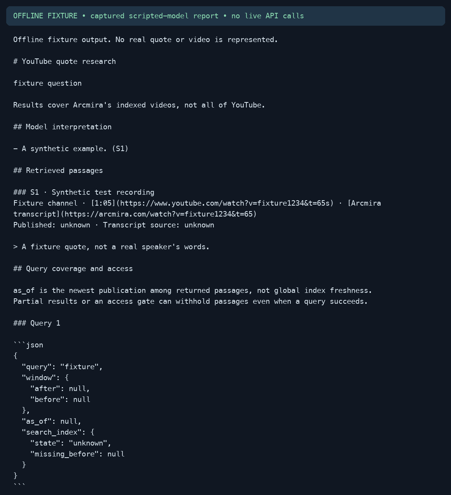
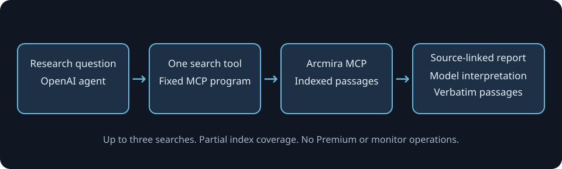

# YouTube quote research

Find spoken passages across indexed YouTube videos and produce a report with source timestamps where available. This command-line example uses the OpenAI Agents SDK and [Arcmira](https://arcmira.com) MCP for researchers and video creators checking source material.



The image shows synthetic offline test output, not a live research result.

## Features

- Search for a topic or phrase, then inspect the exact returned passages and timestamped video links where available.
- Keep model interpretation separate from source text. The application builds quotations and links; the model supplies interpretations with source IDs.
- Limit each run to three searches of up to three passages. The model cannot submit JavaScript, request Premium transcripts, or create monitors.

Coverage is partial. An empty result means no passages were returned; query metadata explains any access gate, retrieval failures or index gaps. Transcript text is not an independent verification of the recording, and this example does not identify or verify speakers.

## Tech stack

- Python 3.10 or newer.
- OpenAI Agents SDK for the tool loop and structured model output.
- Arcmira's remote HTTP MCP for the search reference and indexed transcript search.
- Pydantic for the model's report schema; standard-library `unittest` for offline tests.

## Workflow



The agent chooses a short query. A local function first calls `arcmira_describe` with the search topic, then passes a fixed `arcmira.search` program to `arcmira_execute_read`. Query text is JSON-encoded data, never executable code. The raw MCP tools are not exposed to the model.

Retrieved passages receive local IDs. The model returns interpretations that reference those IDs. The renderer rejects unknown IDs, keeps returned passage text separate, and constructs Arcmira transcript and original YouTube links from validated video IDs and timestamps. Truncated or uncertain MCP output stops the run instead of producing incomplete quotations. Successful responses with partial retrieval still render their surviving passages, together with each query's window, search-index state, failure count and access metadata. `as_of` means the newest publication among returned passages, not global index freshness. Missing titles and channel names use explicit unknown labels; a missing timestamp links to the video without inventing an offset. Publication dates and transcript source classes appear alongside each citation.

## Getting started

### Prerequisites

- [uv](https://docs.astral.sh/uv/) and Python 3.10+.
- An [Arcmira account](https://arcmira.com) and API key with research access. See the [API docs](https://arcmira.com/docs) and [MCP setup](https://arcmira.com/docs/mcp-server).
- An OpenAI or Nebius Token Factory API key and a model available to your account that supports function tools and JSON-schema structured output.

Arcmira offers free and paid plans. Indexed searches use your account's metered allowance; paid reads use plan credits, then your enabled on-demand budget. See [plans and usage](https://arcmira.com/docs/usage-and-billing) for current billing details. Model calls have separate provider costs. Running this example authorizes those normal account usage flows; the three-search and six-turn limits are not a currency budget. No Premium processing or monitor writes are implemented.

### Installation

```bash
git clone https://github.com/Arindam200/awesome-ai-apps.git
cd awesome-ai-apps/mcp_ai_agents/youtube_quote_research
uv sync
cp .env.example .env
```

### Environment variables

Set these values in `.env`, which is ignored by Git:

```dotenv
ARCMIRA_API_KEY=your_arcmira_api_key
MODEL_PROVIDER=openai
OPENAI_API_KEY=your_openai_api_key
OPENAI_MODEL=your_supported_model_id
```

For [Nebius Token Factory](https://docs.tokenfactory.nebius.com/), use this configuration instead. No OpenAI key is required:

```dotenv
ARCMIRA_API_KEY=your_arcmira_api_key
MODEL_PROVIDER=nebius
NEBIUS_API_KEY=your_nebius_api_key
NEBIUS_MODEL=your_supported_model_id
```

Nebius uses the SDK's Chat Completions adapter at `https://api.tokenfactory.nebius.com/v1/`. Choose a model from your account's current catalog that supports both function calling and JSON-schema structured output. There is no automatic provider fallback. Omitting `MODEL_PROVIDER` preserves the OpenAI default.

The application reads `.env` beside `main.py`. SDK tracing is disabled, and the API key goes only in the MCP Authorization header. Queries and retrieved passages are sent to the selected model provider to generate the interpretation. Do not use private research material unless those data flows are acceptable to you.

## Usage

```bash
uv run python main.py "What are people saying about reusable rockets?"
uv run python main.py "Find discussions of stablecoin payments" --output report.md
```

Output files must not already exist. API access or usage errors stop the run and retain the returned error code. The example does not automatically repeat failed searches, change plans, or fall back to a different transcript source.

See [example output](assets/example-output.md) for a report generated by the offline test's scripted model and synthetic MCP response. Its quote, channel and video ID are fixtures, not real research results. No live model or authenticated MCP run is claimed, including Nebius inference.

## Testing

```bash
uv run python -m unittest discover -s tests -v
uv run ruff check main.py tests
uv run ruff format --check main.py tests
```

Tests need no keys or network. They exercise the real SDK tool loop using a scripted model and mocked MCP responses, plus query escaping, search limits, invalid citations, malformed source data, truncation, empty results and API errors.

Dependencies are pinned and resolution excludes releases after October 1, 2026. The repository ignores `uv.lock`; `uv sync` creates a local lockfile.

## Project structure

```text
youtube_quote_research/
├── assets/
│   ├── example-output.md
│   ├── offline-demo.gif
│   └── workflow.svg
├── tests/test_research.py
├── .env.example
├── .gitignore
├── main.py
├── pyproject.toml
└── README.md
```

## Contributing

Follow the repository's [contribution guide](../../CONTRIBUTING.md). This example was proposed in [issue 357](https://github.com/Arindam200/awesome-ai-apps/issues/357).

## License

[MIT](../../LICENSE), like the containing repository.

## Acknowledgments

The existing [MCP starter](../mcp_starter) provides the repository's OpenAI Agents SDK pattern. Arcmira's public [MCP source](https://github.com/arcmira/mcp) documents the search response used here.
