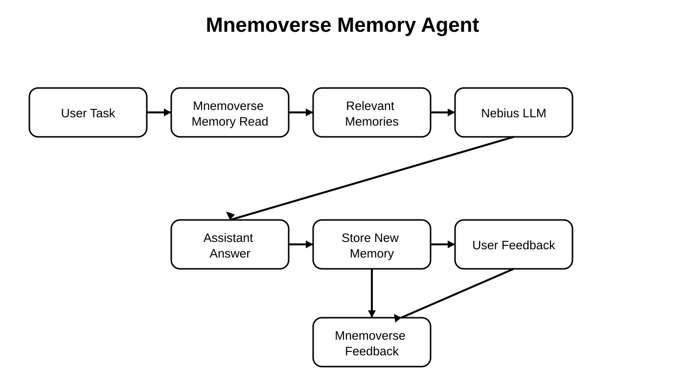

# Mnemoverse Memory Agent

A runnable project assistant using Mnemoverse for persistent memory and user feedback.

## Features

- Recalls relevant memories before answering.
- Stores new task and answer context.
- Collects helpful or misleading feedback.
- Demonstrates persistent memory across sessions.
- Uses Nebius Token Factory for LLM responses.
- Handles missing credentials and service errors.

## Tech Stack

- Python 3.10+
- Mnemoverse Python SDK
- Nebius Token Factory
- OpenAI Python SDK
- python-dotenv

## Workflow

User Task
->
Mnemoverse Memory Read
->
Relevant Memories
->
Nebius LLM
->
Assistant Answer
->
Store New Memory
->
User Feedback
->
Mnemoverse Feedback
->
Improved Future Recall

## Getting Started

### Prerequisites

- Python 3.10+
- Mnemoverse API key
- Nebius Token Factory API key

### Environment Variables

Copy .env.example to .env and add your API keys.

Never commit .env to Git.

### Installation

Create a virtual environment and install the project with:

python -m venv .venv
source .venv/bin/activate
pip install -e .

### Usage

Run:

python main.py

The agent:

1. Reads relevant memories from Mnemoverse.
2. Uses recalled memories as context for the LLM.
3. Generates an answer.
4. Stores the interaction as a new memory.
5. Asks whether recalled memories were helpful or misleading.
6. Sends feedback to Mnemoverse.

Run the agent again with a related task to demonstrate persistent memory across sessions.

## Project Structure

mnemoverse_memory_agent/
- assets/
- .env.example
- .gitignore
- main.py
- pyproject.toml
- README.md

## Error Handling

The agent handles:

- Missing API keys
- Authentication failures
- Rate limits
- Mnemoverse service errors

## Contributing

Please follow the contribution guidelines of the parent repository.

## License

This project follows the license of the parent repository.

## Acknowledgments

- Mnemoverse
- Nebius Token Factory
- Awesome AI Apps
