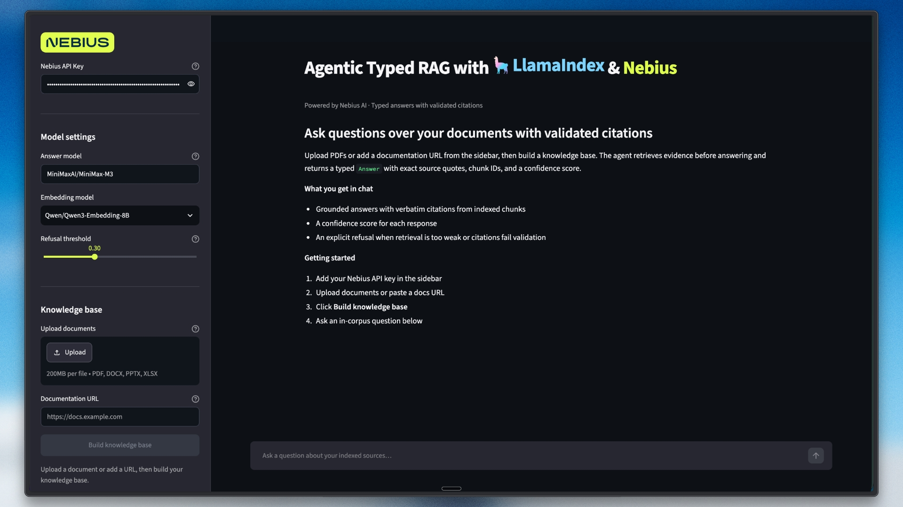

# Typed Agentic RAG with LlamaIndex + Nebius Token Factory

This Streamlit app answers questions from uploaded documents or a documentation URL.
Every response is a validated `Answer` object with exact source quotes, chunk IDs,
a confidence score, and an `answered` decision. If retrieval is too weak, the app
refuses before calling the language model.

## Features

- LlamaIndex `FunctionAgent` with a typed `retrieve` tool and `output_cls` structured output
- Nebius Token Factory for both the chat model and the embeddings — one API key
- [LiteParse](https://developers.llamaindex.ai/liteparse/) document parsing — fully local, no cloud, no extra API key
- PDF, DOCX, PPTX, and XLSX uploads parsed to structured Markdown per page
- A session-scoped LlamaIndex `VectorStoreIndex` with no database service
- Pydantic models for answers, citations, and retrieval evidence
- Exact quote checks against indexed chunks after model output validation
- A deterministic refusal gate for out-of-corpus questions

## How it works

1. `rag.py` parses uploaded documents page by page into Markdown with LiteParse
   (or fetches web text), splits it with LlamaIndex's `SentenceSplitter`, embeds
   the chunks with `NebiusEmbedding`, and stores them in an in-memory
   `VectorStoreIndex` under stable, human-readable chunk IDs like
   `handbook.pdf:p2:c3`.
2. `agent.py` wires a `FunctionAgent` (on `NebiusLLM` with tool calling enabled)
   to a typed `retrieve` tool. The agent must call `retrieve` before producing an
   `Answer`, and `output_cls=Answer` makes LlamaIndex validate the final output
   against the Pydantic schema.
3. A preflight search compares the best retrieval score with the refusal
   threshold. Low scores return `answered=False` without an LLM request.
4. For an answered response, each citation must match a stored source, chunk ID,
   and verbatim quoted span. An invalid or missing citation becomes a refusal —
   forged quotes never reach the UI.
5. `app.py` renders the answer, confidence, citations, or refusal state.

## Prerequisites

- Python 3.12 or newer
- A [Nebius Token Factory](https://dub.sh/nebius) API key
- Optional: [LibreOffice](https://www.libreoffice.org/), only if you want to
  upload DOCX, PPTX, or XLSX files (LiteParse converts them locally through it).
  PDFs work with no extra install.

## Setup

From the repository root:

```bash
cd rag_apps/agentic_typed_rag_llamaindex
uv sync
cp .env.example .env
```

Add your key to `.env`:

```text
NEBIUS_API_KEY=your-key
```

The default answer model is `MiniMaxAI/MiniMax-M3` and the default
embedding model is `Qwen/Qwen3-Embedding-8B`. Change them in the sidebar, or set
`RAG_MODEL` / `RAG_EMBEDDING_MODEL` to any Token Factory model that supports
tool calling.

## Run

From `rag_apps/agentic_typed_rag_llamaindex`:

```bash
streamlit run app.py
```

Upload one or more documents, optionally add a docs URL, and select **Build
knowledge base**. Ask an in-corpus question to see a cited answer. Then ask
about an unrelated topic to see the refusal state.

## Tests

The deterministic suite uses a local hashing embedding, so it makes no Nebius
requests:

```bash
python3 test_typed_rag.py
```

## Files

```text
agentic_typed_rag_llamaindex/
├── app.py
├── agent.py
├── rag.py
├── test_typed_rag.py
├── pyproject.toml
├── .env.example
└── assets/
```
