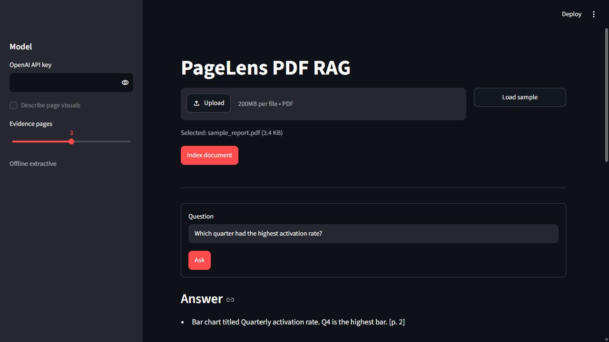
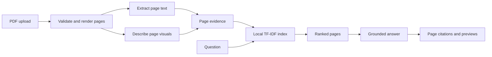

# PageLens PDF RAG

> A compact image-aware PDF RAG app that retrieves text and visual evidence, cites every supporting page, and keeps each cited page inspectable.

PageLens renders every uploaded PDF page, combines extracted text with optional multimodal descriptions, and builds an in-memory TF-IDF index. It runs with an offline sample out of the box and can use OpenAI for arbitrary visual PDFs and grounded answer synthesis.

## Features

- PDF validation with clear errors for empty, unreadable, encrypted, oversized, and textless documents.
- Page-level text extraction and PNG rendering with PyMuPDF.
- Optional chart, table, and diagram descriptions from an OpenAI vision model.
- Dependency-free TF-IDF cosine retrieval over text and visual evidence.
- Answers with explicit `[p. N]` citations and expandable page previews.
- Offline sample PDF with a text question and a chart question.
- Deterministic unit tests with no model or network calls.

## Tech Stack

- **Python 3.10+**: Core runtime.
- **Streamlit**: Upload, question, and cited-page inspection UI.
- **PyMuPDF**: PDF validation, text extraction, and page rendering.
- **OpenAI**: Optional visual descriptions and answer synthesis.
- **ReportLab**: Generates the license-compatible sample PDF.
- **pytest**: Offline contract and retrieval tests.

## Workflow



The PDF is indexed at page granularity so retrieval results and answer citations always point to an inspectable page. The OpenAI path sends rendered page images only when visual parsing is enabled. The bundled sample instead injects known visual descriptions and remains fully offline.

## Getting Started

### Prerequisites

- Python 3.10 or newer
- `uv` or `pip`
- An OpenAI API key only for uploaded visual PDFs or generated answers

### Environment Variables

Copy `.env.example` to `.env`:

```env
OPENAI_API_KEY=
OPENAI_VISION_MODEL=gpt-4.1-mini
OPENAI_ANSWER_MODEL=gpt-4.1-mini
```

Leave `OPENAI_API_KEY` empty to use the offline sample and extractive answers.

### Installation

```bash
git clone https://github.com/Arindam200/awesome-ai-apps.git
cd awesome-ai-apps/rag_apps/image_aware_pdf_rag

python -m venv .venv
source .venv/bin/activate
pip install -e ".[dev]"
```

On Windows, activate the environment with `.venv\Scripts\activate`.

## Usage

Start the app:

```bash
streamlit run app.py
```

Open `http://localhost:8501`, choose **Load sample**, and index the document. Try both acceptance-path questions:

```text
How much did annual recurring revenue grow?
Which quarter had the highest activation rate?
```

The second question is answered from the bar-chart description and cites page 2. Expand the evidence row to inspect the rendered source page.

Generate the sample files directly when testing another client:

```bash
python create_sample_pdf.py
```

This writes `sample_report.pdf` and `sample_report.visual.json`. Both are generated from source code in this directory and may be regenerated freely under the repository license.

Run the offline tests:

```bash
pytest -q
```

## Project Structure

```text
image_aware_pdf_rag/
|-- assets/
|   `-- demo.png
|-- tests/
|   `-- test_rag.py
|-- .env.example
|-- app.py
|-- create_sample_pdf.py
|-- pyproject.toml
|-- rag.py
`-- README.md
```

## Design Notes

- The demo caps uploads at 20 MB and 50 pages to keep in-memory processing predictable.
- Retrieval is intentionally local and transparent. Swap the TF-IDF index for a vector database when persistence or corpus-scale search is required.
- Ranked pages below 20% of the best score are discarded so weak lexical overlap does not pollute an otherwise focused answer.
- The precomputed sample descriptions are not used for arbitrary uploads. Configure a vision model for scanned pages, charts, diagrams, or tables without a useful text layer.
- Production deployments should add authenticated object storage, background ingestion, rate limits, and persistent indexes.

## License

This example follows the repository's MIT License.
