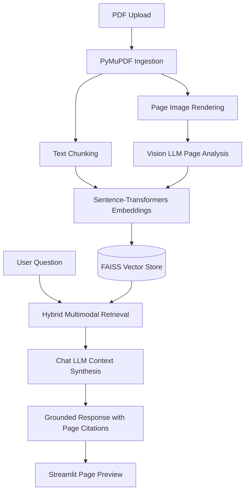

# Image-Aware PDF RAG

> A multimodal Retrieval-Augmented Generation (RAG) application capable of answering queries across text, tables, charts, and architectural diagrams in PDF documents with page-level citations.


Image-Aware PDF RAG bridges the gap between unstructured text search and visual document intelligence. Built with Streamlit, Nebius Token Factory vision and chat models, local Sentence-Transformers embeddings, and a FAISS vector store.

## 🚀 Features

- **Multimodal Indexing**: Simultaneously extracts dense text chunks and page-level visual descriptions using Vision LLMs.
- **Visual Understanding**: Answers questions about charts, statistical plots, tables, and system architecture diagrams.
- **Grounded Citations**: Grounded answers with exact page numbers and evidence summaries for fast verification.
- **Interactive Document Preview**: Side-by-side Streamlit dashboard to preview the cited PDF page directly.
- **Fast Inference**: Powered by Groq for high-speed multimodal understanding and conversational responses.
- **Provider Agnostic**: Clean interfaces supporting Groq, OpenAI, and Anthropic Claude vision and chat backends.

## 🛠️ Tech Stack

- **Python**: Core programming language (3.10+)
- **Streamlit**: Web interface and interactive document viewer
- **Nebius Token Factory**: Multimodal vision and chat language models (`google/gemma-3-27b-it` for vision, `openai/gpt-oss-120b` for chat)
- **Sentence-Transformers**: Local embeddings (`all-MiniLM-L6-v2`)
- **FAISS**: Dense vector similarity search index
- **PyMuPDF**: High-fidelity PDF rendering and text extraction

## Workflow


```mermaid
flowchart TD
    A[PDF Upload] --> B[PyMuPDF Ingestion]
    B --> C[Text Chunking]
    B --> D[Page Image Rendering]
    D --> E[Vision LLM Page Analysis]
    C --> F[Sentence-Transformers Embeddings]
    E --> F
    F --> G[(FAISS Vector Store)]
    H[User Question] --> I[Hybrid Multimodal Retrieval]
    G --> I
    I --> J[Chat LLM Context Synthesis]
    J --> K[Grounded Response with Page Citations]
    K --> L[Streamlit Page Preview]
```

1. **Ingestion & Rendering**: The uploaded PDF is ingested using PyMuPDF to extract text and render high-resolution page images.
2. **Dual Representation**: Text is split into bounded chunks while pages with visual assets are analyzed by a Vision LLM to generate descriptive summaries.
3. **Multimodal FAISS Indexing**: Both textual chunks and visual descriptions are converted into dense vectors via `Sentence-Transformers` and indexed in FAISS with metadata tracking page numbers and asset types.
4. **Retrieval & Grounded Synthesis**: When a query is submitted, FAISS retrieves the most relevant text and visual evidence. The chat model synthesizes the final answer with page-level citations for interactive verification.

## 📦 Getting Started

### Prerequisites

- Python 3.10+
- [uv](https://github.com/astral-sh/uv) or `pip`
- A [Nebius API Key](https://nebius.com/services/studio) for inference.

### Environment Variables

Create a `.env` file in the project directory based on [.env.example](.env.example):

```bash
cp .env.example .env
```

```env
NEBIUS_API_KEY="your_nebius_api_key"
NEBIUS_CHAT_MODEL="openai/gpt-oss-120b"
NEBIUS_VISION_MODEL="google/gemma-3-27b-it"
```

### Installation

1. **Clone the repository:**
   ```bash
   git clone https://github.com/Arindam200/awesome-ai-apps.git
   cd awesome-ai-apps/rag_apps/image_aware_pdf_rag
   ```

2. **Create and activate a virtual environment:**
   ```bash
   python -m venv .venv
   # Windows:
   .venv\Scripts\activate
   # Linux/macOS:
   source .venv/bin/activate
   ```

3. **Install dependencies:**
   ```bash
   pip install -e ".[dev]"
   # Or using uv:
   uv pip install -e ".[dev]"
   ```

## ⚙️ Usage

1. **Run the Streamlit application:**
   ```bash
   streamlit run app.py
   ```

2. **Open your browser** to `http://localhost:8501`.

3. **Upload and Index**: Upload a PDF (you can generate a test document using `python sample_data/create_sample_pdf.py`). Click **"🚀 Index Document"**.

4. **Ask and Verify**: Ask natural language questions about text or visual elements (e.g., *"What does the chart on page 2 show?"* or *"What are the key results in the table on page 3?"*). Click **"View page"** on citations to inspect the source page directly.

## 📂 Project Structure

```
image_aware_pdf_rag/
├── app.py                      # Main Streamlit UI and session management
├── chunking.py                 # Text chunking and windowing logic
├── citations.py                # Source attribution and citation extraction
├── ingestion.py                # PDF ingestion and page rendering via PyMuPDF
├── markdown_utils.py           # Markdown response sanitization
├── pipeline.py                 # End-to-end RAG pipeline orchestration
├── vision.py                   # High-level vision description coordinator
├── embeddings/                 # Embeddings implementation (Sentence-Transformers)
├── interfaces/                 # Abstract contracts for chat, vision, store, embeddings
├── providers/                  # Nebius Token Factory chat and vision adapters
├── retrieval/                  # Semantic retriever implementation
├── assets/                     # Screenshots and demo assets
├── sample_data/                # Synthetic PDF generator with raster bar chart
├── tests/                      # Unit and integration test suite
├── vectorstores/               # Thread-safe in-memory FAISS store
├── pyproject.toml              # Project metadata and dependencies
└── README.md                   # Project documentation
```

## 🤝 Contributing

Contributions are welcome! Please feel free to submit a Pull Request. See [CONTRIBUTING.md](https://github.com/Arindam200/awesome-ai-apps/blob/main/CONTRIBUTING.md) for more details.

## 📄 License

This project is licensed under the [MIT License](https://github.com/Arindam200/awesome-ai-apps/blob/main/LICENSE).
