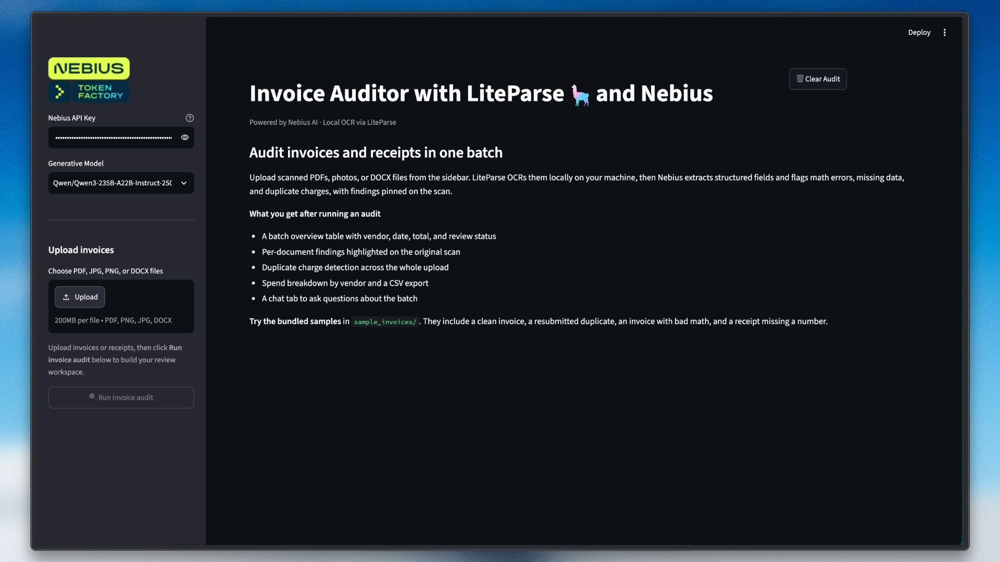

# 🧾 AI Invoice & Receipt Auditor

> Drop in a batch of scanned invoices or receipts — they're OCR'd 100% locally, audited by an LLM for math errors and duplicate charges, and every finding is visually pinned to the exact spot on the scan.

Built with [LiteParse](https://developers.llamaindex.ai/liteparse/) (LlamaIndex's open-source local document parser), [Nebius Token Factory](https://dub.sh/nebius), and Streamlit.

## 🚀 Features

- **Local OCR, private by design**: LiteParse parses PDFs, scans, and photos entirely on your machine — no cloud parsing, no API key, no document ever uploaded. Only the extracted text goes to the LLM.
- **Visual evidence pinning**: LiteParse returns bounding boxes for every text line, so each audit finding is highlighted directly on the scanned page, color-coded by severity (🔴 high / 🟠 medium / 🟡 low).
- **LLM-powered audit**: A Nebius-hosted model extracts structured data (vendor, date, line items, totals) and checks arithmetic, tax plausibility, missing fields, and suspicious patterns.
- **Cross-batch duplicate detection**: Deterministic matching on (vendor, total, date) catches the same charge submitted twice — even under different filenames.
- **Expense dashboard**: Batch overview table, spend-by-vendor chart, CSV export, and an LLM-generated batch summary.

## 🛠️ Tech Stack

- **Python 3.10+**: Core language
- **Streamlit**: Web interface
- **LiteParse**: Local document parsing + OCR with bounding boxes (no cloud, no LLMs)
- **LlamaIndex Nebius integration**: LLM inference through `NebiusLLM` from
  `llama-index-llms-nebius` (Qwen3-235B, Llama 3.3 70B, DeepSeek V3)
- **Pillow / pandas**: Evidence rendering and tabular views

## Workflow

1. **Upload** invoices/receipts (PDF, PNG, JPG, DOCX). Images are wrapped into PDFs with Pillow so LiteParse can OCR them without any system dependencies.
2. **Parse locally** — LiteParse OCRs each page and returns markdown plus a bounding box for every text line.
3. **Audit** — the page-tagged text is sent to a Nebius LLM, which returns structured JSON: extracted fields, line items, and findings with *verbatim evidence quotes*.
4. **Pin evidence** — each quote is matched back to its bounding boxes and highlighted on a rendered screenshot of the page.
5. **Cross-check** — duplicates are detected deterministically across the batch, and everything lands in a dashboard with CSV export and an LLM batch summary.

## 📦 Getting Started

### Prerequisites

- Python 3.10+
- [uv](https://github.com/astral-sh/uv) or pip
- A [Nebius Token Factory](https://dub.sh/nebius) API key

### Installation

```bash
git clone https://github.com/Arindam200/awesome-llm-apps.git
cd awesome-llm-apps/rag_apps/liteparse_invoice_auditor

uv venv && uv pip install -e .
# or: pip install -e .

cp .env.example .env   # add your NEBIUS_API_KEY
```

### Run

```bash
streamlit run app.py
```

Then upload the bundled **`sample_invoices/`** to see the auditor in action:

| File | What's inside |
|---|---|
| `acme_invoice_0042.pdf` | Clean invoice ✅ |
| `acme_invoice_0042_resubmitted.pdf` | Same invoice resubmitted — flagged as a 🔁 duplicate |
| `globex_invoice_113.pdf` | Line math wrong (12 × 85 ≠ 1,120) and inflated total — 🔴 flagged with boxes on the bad numbers |
| `initech_receipt.pdf` | Valid receipt missing a receipt number — 🟠 flagged |

The samples are image-only PDFs (no text layer), so they exercise the real OCR path. Regenerate them anytime with `python sample_invoices/generate_samples.py`.

## 🔍 Technical Notes

- **Models**: Defaults to `Qwen/Qwen3-235B-A22B-Instruct-2507`; `meta-llama/Llama-3.3-70B-Instruct` and `deepseek-ai/DeepSeek-V3-0324` selectable in the sidebar.
- **Evidence matching**: The LLM is instructed to quote the document verbatim; quotes are matched to OCR text items via normalized substring overlap, then drawn at `screenshot_width / page_width` scale.
- **Privacy boundary**: Document parsing and rendering are fully local. The only data leaving your machine is the extracted text sent to Nebius for the audit and batch summary.
