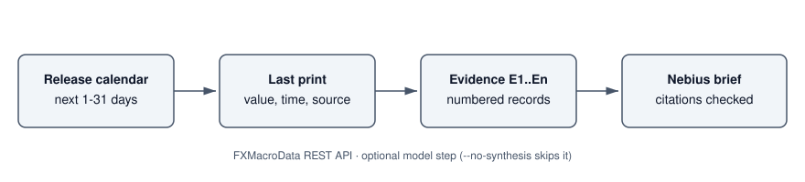

# Macro Event Brief Agent

> A pre-trade brief of the scheduled macro releases for one currency: when each one is due, what the last print was, when it was published and where it came from.

Before trading a currency pair you want to know which releases land in the next few days and what the last numbers were. This agent pulls the upcoming release calendar and the latest published value of each scheduled indicator from [FXMacroData](https://fxmacrodata.com), lays them out as numbered evidence records, and can ask a [Nebius Token Factory](https://tokenfactory.nebius.com/) model to turn them into a short brief in which every point cites the records it relies on.

## 🚀 Features

- **Scheduled releases**: the official release calendar for the next 1-31 days, filtered by market tier so routine weekly data can be left out.
- **Last print beside each release**: value, previous value, reference period, publication time and source link for every scheduled indicator.
- **Grounded model brief**: the model only sees the evidence records, must cite an evidence ID for every point, and citations to records that don't exist are rejected.
- **Evidence-only mode**: `--no-synthesis` skips the model, so the example runs with no keys at all for USD.
- **Free-tier notices**: when no FXMacroData key is set, the API's 15-minute delay and 90-day window messages are printed with the brief.

## 🛠️ Tech Stack

- **Python 3.9+**, standard library only
- **FXMacroData REST API** for release calendars and published values
- **Nebius Token Factory** (OpenAI-compatible chat completions) for the optional brief

## Workflow

1. `GET /v1/calendar/{currency}` for the look-ahead window, keeping releases at or above `--max-tier` (1 is the most market-moving), soonest first.
2. `GET /v1/announcements/{currency}/{indicator}?limit=1` once per scheduled indicator for the last published value.
3. Build evidence records `E1`, `E2`, ... with the scheduled time, reference period, last value, publication time and source.
4. Optionally send the records to Nebius, validate the JSON reply and its citations, and label it as unverified model output.
5. Print Markdown (default) or JSON.

A release's reference period (for example "September 2026" for September CPI) is not the day it is published. The brief keeps the two apart, which matters if you reuse the records in a backtest.

## 📦 Getting Started

### Prerequisites

- Python 3.9+
- A [Nebius Token Factory](https://tokenfactory.nebius.com/) API key for the model brief (optional)
- An [FXMacroData](https://fxmacrodata.com/subscribe) API key for currencies other than USD (optional)

### Environment Variables

Copy `.env.example` to `.env` and fill in what you need, or export the variables in your shell:

```env
NEBIUS_API_KEY="your_nebius_token_factory_api_key"
FXMACRODATA_API_KEY=""
```

Without `FXMACRODATA_API_KEY` the USD calendar and the last 90 days of USD releases are available, delayed by 15 minutes. Other currencies, full history and real-time releases need a key. Keys are sent only in request headers, redirects are not followed, and keys are removed from anything the script prints.

### Installation

```bash
git clone https://github.com/Arindam200/awesome-ai-apps.git
cd awesome-ai-apps/simple_ai_agents/macro_event_brief_agent
```

There is nothing to install.

## ⚙️ Usage

```bash
# Evidence only, no keys needed
python main.py --no-synthesis

# Only the biggest releases over the next two weeks
python main.py --no-synthesis --max-tier 1 --days 14

# With a model brief (needs NEBIUS_API_KEY)
export NEBIUS_API_KEY=...
python main.py

# Another currency (needs FXMACRODATA_API_KEY), JSON output
python main.py --currency eur --json
```

Example output (evidence only, USD):

```text
# USD macro event brief

## Scheduled releases

| ID | Release | Due (local) | Period | Last value | Last published | Source |
|---|---|---|---|---|---|---|
| E1 | Consumer Confidence Proxy (FRBNY SCE) | 2026-10-07T11:00:00-04:00 | 2026-09-30 | 46.61 | 2026-09-08T11:00:00-04:00 | https://www.newyorkfed.org/ |
| E2 | Business Confidence Proxy (Census BTOS) | 2026-10-08T10:00:00-04:00 | 2026-09-20 | 58.6 | 2026-09-10T10:00:00-04:00 | https://www.census.gov/hfp/btos/downloads/National.xlsx |
| E3 | Core Inflation | 2026-10-14T08:30:00-04:00 | September 2026 | 2.4 | 2026-09-11T08:30:00-04:00 | https://www.bls.gov/news.release/archives/cpi_09112026.htm |
| E4 | Inflation (CPI) | 2026-10-14T08:30:00-04:00 | September 2026 | 3.4 | 2026-09-11T08:30:00-04:00 | https://www.bls.gov/news.release/archives/cpi_09112026.htm |

## Data notices

- Free access is delayed by 15 minutes. Releases published in the last 15 minutes are withheld. An Individual or Business API key returns them in real time.
- Anonymous access returns the most recent 90 days. Supply an API key for the full history.
```

### Tests

The tests use recorded API responses in `fixtures/` and make no network or model calls:

```bash
python -m unittest discover -s tests
```

## 📂 Project Structure

```
macro_event_brief_agent/
├── main.py                       # calendar + last prints + optional Nebius brief
├── fixtures/sample_responses.json
├── tests/test_main.py
├── .env.example
└── requirements.txt
```

## Notes

The calendar has no consensus forecasts, so the brief does not include any. The model brief is a summary of the cited records, not trading advice.
