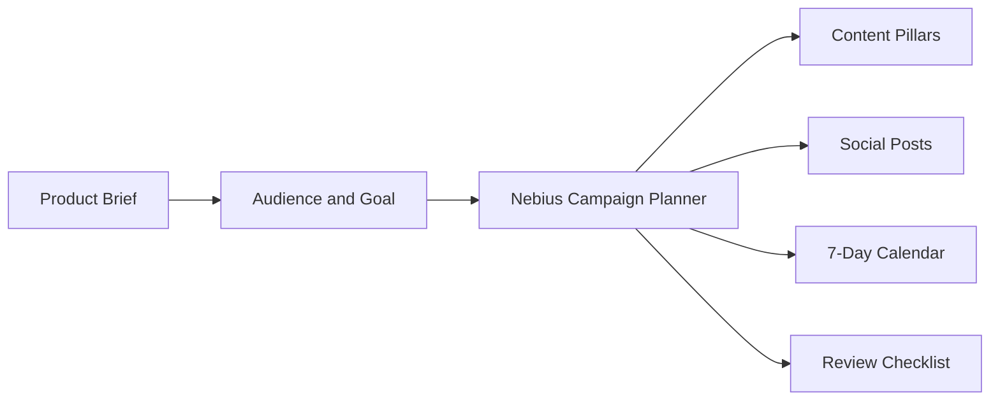

# Nebius Social Campaign Planner

> A Streamlit app that turns a product brief into a launch-ready social media campaign with Nebius.

This project uses Nebius through `langchain-nebius` to generate content pillars, channel-specific posts, a 7-day calendar, and a pre-publish review checklist from a short product brief.

## Features

- **Campaign Strategy**: Generate positioning and content pillars from a product brief.
- **Channel-Specific Posts**: Draft posts for X/Twitter, LinkedIn, Reddit, newsletters, and Product Hunt.
- **Launch Calendar**: Build a 7-day campaign plan with daily tasks.
- **Review Checklist**: Add quality and safety checks before publishing.
- **Streamlit UI**: Run the workflow locally without extra frontend setup.

## Tech Stack

- **Python**: Core application language
- **Streamlit**: Interactive web UI
- **Nebius**: LLM provider for campaign generation
- **LangChain Nebius**: Nebius chat model integration
- **python-dotenv**: Local environment loading

## Workflow



1. Enter a product or launch brief.
2. Choose audience, campaign goal, tone, and channels.
3. Nebius generates a structured JSON campaign plan.
4. Review and copy the posts or calendar into your publishing workflow.

## Getting Started

### Prerequisites

- Python 3.11+
- [uv](https://github.com/astral-sh/uv) or pip
- Nebius API key

### Environment Variables

Create a `.env` file in this project directory:

```env
NEBIUS_API_KEY=your_nebius_api_key_here
```

### Installation

Clone the repository and open the project directory:

```bash
git clone https://github.com/Arindam200/awesome-ai-apps.git
cd awesome-ai-apps/simple_ai_agents/nebius_social_campaign_planner
```

Install dependencies:

```bash
uv sync
```

Or with pip:

```bash
python -m venv .venv
source .venv/bin/activate
pip install streamlit langchain-nebius langchain-core python-dotenv
```

## Usage

Run the app:

```bash
uv run streamlit run app.py
```

Open the local Streamlit URL, add your Nebius API key, fill in the campaign brief, and click **Generate Campaign**.

## Project Structure

```text
nebius_social_campaign_planner/
├── .env.example
├── app.py
├── pyproject.toml
└── README.md
```

## Notes

- The app asks Nebius for valid JSON and renders each campaign section separately.
- Generated copy should be reviewed before publishing.
- No social platform credentials are required because this project focuses on planning and drafting.

## License

This project is licensed under the MIT License. See the repository [LICENSE](../../LICENSE) file for details.
