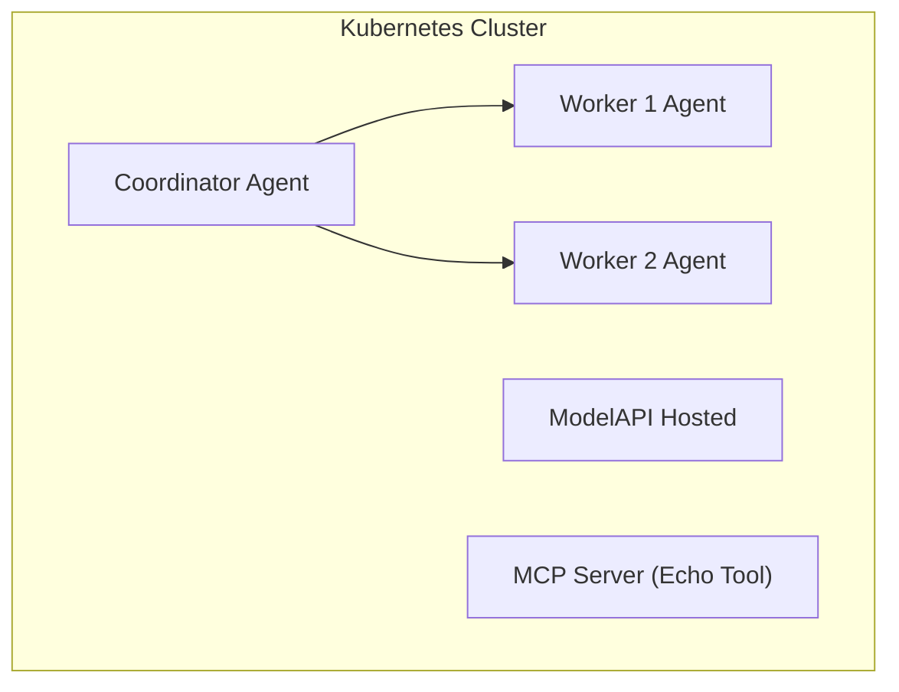

# KAOS Starter - Kubernetes Multi-Agent System

A starter example demonstrating how to deploy a multi-agent system on Kubernetes using **KAOS** (K8s Agent Orchestration System). This example sets up a coordinator agent with two worker agents and MCP tools.

## Overview

This starter showcases:

- Deploying AI agents as Kubernetes-native resources
- Multi-agent coordination with a coordinator and workers
- MCP (Model Context Protocol) tool integration
- Agent memory for tracking events and sessions
- In-cluster hosted LLM (Ollama with smollm2)

## Architecture



## Prerequisites

- **Kubernetes cluster** (Docker Desktop, KIND, or any K8s cluster)
- **kubectl** configured to access your cluster
- **Helm 3.x** for installing KAOS operator

## Setup

### 1. Install the KAOS Operator

```bash
# Add the KAOS Helm repository
helm install kaos-operator oci://ghcr.io/axsaucedo/kaos/kaos-operator \
  --namespace kaos-system \
  --create-namespace
```

Verify the operator is running:

```bash
kubectl get pods -n kaos-system
```

For more installation options, see the [KAOS Installation Guide](https://github.com/axsaucedo/kaos#installation).

### 2. Deploy the Multi-Agent System

Apply the sample configuration:

```bash
kubectl apply -f multi-agent-system.yaml
```

This creates:
- **Namespace**: `kaos-demo`
- **ModelAPI**: Hosted Ollama with smollm2 model
- **MCPServer**: Echo tool for testing
- **Agents**: Coordinator + 2 workers

### 3. Wait for Resources to be Ready

```bash
# Watch the pods come up
kubectl get pods -n kaos-demo -w

# Check agent status
kubectl get agents -n kaos-demo
```

## Interacting with Agents

### Call an Agent

Send a message to the coordinator agent:

```bash
# Port-forward to the coordinator agent
kubectl port-forward svc/coordinator -n kaos-demo 8080:8000 &

# Send a chat completion request
curl http://localhost:8080/v1/chat/completions \
  -H "Content-Type: application/json" \
  -d '{
    "model": "smollm2:135m",
    "messages": [{"role": "user", "content": "Hello! Can you delegate a task to worker-1?"}]
  }'
```

### View Agent Memory Events

Check what events have been recorded:

```bash
# Get all events (with limit)
curl "http://localhost:8080/memory/events?limit=10"

# Get events for a specific session
curl "http://localhost:8080/memory/events?session_id=YOUR_SESSION_ID"
```

### Call the MCP Tool Directly

```bash
# Port-forward to the MCP server
kubectl port-forward svc/demo-echo-mcp -n kaos-demo 8081:8000 &

# Call the echo tool
curl http://localhost:8081/mcp/call \
  -H "Content-Type: application/json" \
  -d '{
    "tool": "echo",
    "arguments": {"message": "Hello from MCP!"}
  }'
```

## End-to-End Flow

Here's a complete example showing the multi-agent delegation flow:

```bash
# 1. Start port-forward
kubectl port-forward svc/coordinator -n kaos-demo 8080:8000 &

# 2. Send a task that requires delegation
curl http://localhost:8080/v1/chat/completions \
  -H "Content-Type: application/json" \
  -d '{
    "model": "smollm2:135m",
    "messages": [
      {"role": "user", "content": "Please ask worker-1 to echo the message: Hello World"}
    ]
  }'

# 3. Check the memory to see the delegation chain
curl "http://localhost:8080/memory/events?limit=20" | jq .

# 4. View all sessions
curl "http://localhost:8080/memory/sessions" | jq .
```

## Using the KAOS UI

KAOS includes a web-based UI for managing and interacting with your agents.

### Quick Start with CLI

```bash
# Install the KAOS CLI
pip install kaos-cli

# Start the UI (opens browser automatically)
kaos ui
```

### Manual UI Access

The UI is hosted at: https://axsaucedo.github.io/kaos-ui/

Configure it to connect to your cluster's proxy endpoint.


## Resources

- [KAOS GitHub Repository](https://github.com/axsaucedo/kaos)
- [Full Documentation](https://github.com/axsaucedo/kaos/tree/main/docs)
- [Agent CRD Reference](https://github.com/axsaucedo/kaos/blob/main/docs/operator/agent-crd.md)
- [Sample Configurations](https://github.com/axsaucedo/kaos/tree/main/operator/config/samples)

