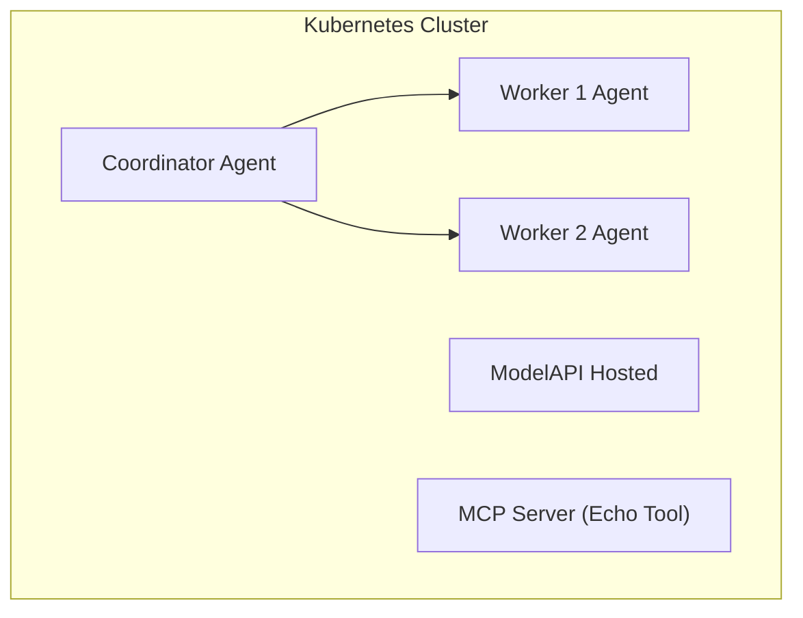

# KAOS Starter - Kubernetes Multi-Agent System

A starter example demonstrating how to deploy a multi-agent system on Kubernetes using **KAOS** (K8s Agent Orchestration System). This example sets up a coordinator agent with two worker agents and MCP tools.

## Overview

This starter showcases:

- Deploying AI agents as Kubernetes-native resources
- Multi-agent coordination with a coordinator and workers
- MCP (Model Context Protocol) tool integration
- Agent memory for tracking events and sessions
- In-cluster hosted LLM (Ollama with smollm2)

## Architecture



## Prerequisites

- **Kubernetes cluster** (Docker Desktop, KIND, or any K8s cluster)
- **kubectl** configured to access your cluster
- **Helm 3.x** for installing KAOS operator

## Setup

### 1. Install the KAOS Operator

```bash
# Add the KAOS Helm repository
helm repo add kaos https://axsaucedo.github.io/kaos/charts
helm repo update

# Install the operator
helm install kaos kaos/kaos-operator \
  --namespace kaos-system \
  --version v0.1.3 \
  --create-namespace
```

Verify the operator is running:

```bash
kubectl get pods -n kaos-system
```

For more installation options, see the [KAOS Installation Guide](https://github.com/axsaucedo/kaos#installation).

### 2. Deploy the Multi-Agent System

Create the namespace

```
kubectl create namespace kaos-demo
```

Create a secret to configure Nebulus api key. 

First ensure that you have your secret key available.

```
export NEBIUS_KEY= <- add your hey here
```

Then create the secret in your cluster

```
kubectl create secret generic nebius-secrets --from-literal "api-key=$NEBIUS_KEY"
```

Apply the sample configuration. You can do it directly from `multi-agent-system.yaml` or one by one as below.

If we do one by one, we can start with the ModelAPI which configures the proxy to the Nebius AI token platform.

```yaml
kubectl apply -f - <<EOF
apiVersion: kaos.tools/v1alpha1
kind: ModelAPI
metadata:
  name: demo-modelapi
  namespace: kaos-demo
spec:
  mode: Proxy
  proxyConfig:
    # Using wildcard allows any model to be used by agents
    # The provider field tells LiteLLM to route via the Nebius provider
    models:
    - "*"
    provider: "nebius"  # All models routed via nebius provider
    apiKey:
      valueFrom:
        secretKeyRef:
          name: nebius-secrets
          key: api-key
EOF
```

Then we can create two demo MCP servers

```yaml
kubectl apply -f - <<EOF
# MCPServer: Echo tool for testing
apiVersion: kaos.tools/v1alpha1
kind: MCPServer
metadata:
  name: demo-echo-mcp
  namespace: kaos-demo
spec:
  type: python-runtime
  config:
    tools:
      fromPackage: "test-mcp-echo-server"

---
# MCPServer: Calculator tool
apiVersion: kaos.tools/v1alpha1
kind: MCPServer
metadata:
  name: demo-calc-mcp
  namespace: kaos-demo
spec:
  type: python-runtime
  config:
    tools:
      fromString: |
        def calculate(expression: str) -> str:
            """Evaluate a mathematical expression and return the result."""
            try:
                result = eval(expression)
                return f"Result: {result}"
            except Exception as e:
                return f"Error: {str(e)}"
EOF
```

Then we can start creating the multi-agent system. First we start with the two worker agents. 

All agents use simple model names (e.g., `openai/gpt-oss-20b`). The ModelAPI's `provider: "nebius"` field automatically routes these via the Nebius provider.

```yaml
kubectl apply -f - <<EOF
# Agent: Worker 1 - general purpose worker
apiVersion: kaos.tools/v1alpha1
kind: Agent
metadata:
  name: worker-1
  namespace: kaos-demo
spec:
  # Simple model name - provider is handled by ModelAPI
  model: "openai/gpt-oss-20b"
  modelAPI: demo-modelapi
  mcpServers:
  - demo-echo-mcp
  config:
    description: "General purpose worker agent"
    instructions: |
      You are worker-1, a general purpose assistant.
      You receive delegated tasks from the coordinator.
      You have access to an echo tool for testing.
      Complete tasks efficiently and return clear results.
    reasoningLoopMaxSteps: 5
  agentNetwork:
    access: []

---
# Agent: Worker 2 - specialized worker
apiVersion: kaos.tools/v1alpha1
kind: Agent
metadata:
  name: worker-2
  namespace: kaos-demo
spec:
  model: "openai/gpt-oss-20b"
  modelAPI: demo-modelapi
  mcpServers:
  - demo-calc-mcp
  config:
    description: "Specialized analysis worker agent"
    instructions: |
      You are worker-2, specialized in analysis and calculations.
      You receive delegated tasks from the coordinator.
      You have access to a calculator tool for math operations.
      Focus on detailed analysis and provide thorough responses.
    reasoningLoopMaxSteps: 5
  agentNetwork:
    access: []
EOF
```

Finally we can create the coordinator agent:

```yaml
kubectl apply -f - <<EOF
# Agent: Coordinator - orchestrates worker agents
apiVersion: kaos.tools/v1alpha1
kind: Agent
metadata:
  name: coordinator
  namespace: kaos-demo
spec:
  model: "openai/gpt-oss-20b"
  modelAPI: demo-modelapi
  mcpServers:
  - demo-echo-mcp
  - demo-calc-mcp
  config:
    description: "Coordinator agent that orchestrates worker agents"
    instructions: |
      You are a coordinator agent managing a team of workers.
      
      You can delegate tasks to:
      - worker-1: General purpose tasks
      - worker-2: Specialized analysis tasks
      
      You have access to these tools:
      - echo: Echo back messages for testing
      - calculate: Evaluate math expressions
      
      When given a task, decide whether to handle it yourself or delegate to a worker.
    reasoningLoopMaxSteps: 10
  agentNetwork:
    access:
    - worker-1
    - worker-2
EOF
```

We now have everything in place and deployed.

### 3. Wait for Resources to be Ready

```bash
# Watch the pods come up
kubectl get pods -n kaos-demo -w

# Check agent status
kubectl get agents -n kaos-demo
```

## Interacting with Agents

### Call an Agent

Send a message to the coordinator agent:

```bash
# Port-forward to the coordinator agent
kubectl port-forward svc/coordinator -n kaos-demo 8080:8000 &

# Send a chat completion request
curl http://localhost:8080/v1/chat/completions \
  -H "Content-Type: application/json" \
  -d '{
    "model": "openai/gpt-oss-20b",
    "messages": [{"role": "user", "content": "Hello! Can you delegate a task to worker-1?"}]
  }'
```

### View Agent Memory Events

Check what events have been recorded:

```bash
# Get all events (with limit)
curl "http://localhost:8080/memory/events?limit=10"

# Get events for a specific session
curl "http://localhost:8080/memory/events?session_id=YOUR_SESSION_ID"
```

### Call the MCP Tool Directly

```bash
# Port-forward to the MCP server
kubectl port-forward svc/demo-echo-mcp -n kaos-demo 8081:8000 &

# Call the echo tool
curl http://localhost:8081/mcp/call \
  -H "Content-Type: application/json" \
  -d '{
    "tool": "echo",
    "arguments": {"message": "Hello from MCP!"}
  }'
```

## End-to-End Flow

Here's a complete example showing the multi-agent delegation flow:

```bash
# 1. Start port-forward
kubectl port-forward svc/coordinator -n kaos-demo 8080:8000 &

# 2. Send a task that requires delegation
curl http://localhost:8080/v1/chat/completions \
  -H "Content-Type: application/json" \
  -d '{
    "model": "openai/gpt-oss-20b",
    "messages": [
      {"role": "user", "content": "Please ask worker-1 to echo the message: Hello World"}
    ]
  }'

# 3. Check the memory to see the delegation chain
curl "http://localhost:8080/memory/events?limit=20" | jq .

# 4. View all sessions
curl "http://localhost:8080/memory/sessions" | jq .
```

## Using the KAOS UI

KAOS includes a web-based UI for managing and interacting with your agents.

### Quick Start with CLI

```bash
# Install the KAOS CLI
pip install kaos-cli

# Start the UI (opens browser automatically)
kaos ui
```

### Manual UI Access

The UI is hosted at: https://axsaucedo.github.io/kaos-ui/

Configure it to connect to your cluster's proxy endpoint.


## Resources

- [KAOS GitHub Repository](https://github.com/axsaucedo/kaos)
- [Full Documentation](https://github.com/axsaucedo/kaos/tree/main/docs)
- [Agent CRD Reference](https://github.com/axsaucedo/kaos/blob/main/docs/operator/agent-crd.md)
- [Sample Configurations](https://github.com/axsaucedo/kaos/tree/main/operator/config/samples)

