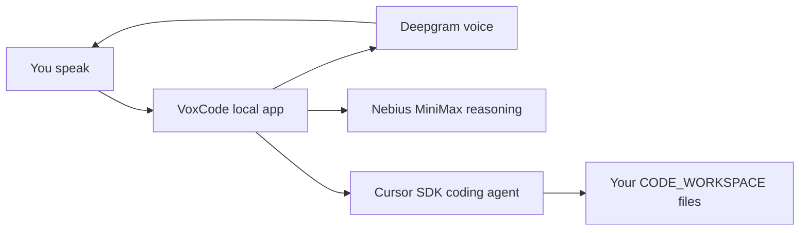

# VoxCode

> Cursor Code Editor — a local voice AI coding workspace in `voice_agents/Cursor_code_editor`.

VoxCode is a local voice AI coding workspace. You can talk to a codebase, ask for summaries, ask architecture questions, and optionally allow Cursor SDK to make file edits.

## Features

- **Voice codebase summaries**: Ask for brief or deep summaries of a workspace or folder by voice.
- **Architecture Q&A**: Talk through how a codebase is structured and what components do.
- **Optional file edits**: Enable Cursor SDK edits for small, specific changes (read-only by default).
- **Activity log**: See Deepgram, Nebius, and Cursor events in the UI while a session runs.

## Tech stack

- **Node.js / TypeScript** — Express + WebSocket backend, Vite + React client
- **[Deepgram](https://developers.deepgram.com/docs/voice-agent)** — Voice Agent orchestration, STT, and TTS
- **[Nebius Token Factory](https://docs.tokenfactory.nebius.com/)** — MiniMax reasoning, tool routing, and response polishing
- **[Cursor SDK](https://cursor.com/docs/sdk/typescript)** — Codebase inspection and file edits in `CODE_WORKSPACE`

The app uses three providers with clear responsibilities:

- **Deepgram**: microphone transcription, Voice Agent WebSocket orchestration, function-call flow, and text-to-speech audio.
- **Nebius Token Factory / MiniMax**: the Voice Agent reasoning model, tool routing, prompt shaping, chat titles, and response polishing.
- **Cursor SDK**: codebase inspection and file edits inside `CODE_WORKSPACE`.

## Architecture



Deepgram turns speech into a live voice session. Nebius decides whether the user is chatting, asking a code question, or requesting an edit, then polishes the response. Cursor SDK performs the actual code work against your local workspace.

## Prerequisites

- Node.js 18 or newer
- A Cursor API key
- A Deepgram API key
- A Nebius Token Factory API key
- A local codebase you want VoxCode to inspect or edit

## Quick Start

```bash
git clone https://github.com/Arindam200/awesome-ai-apps.git
cd awesome-ai-apps/voice_agents/Cursor_code_editor
npm install
cp .env.example .env
```

Open `.env` and fill in your keys:

```bash
CURSOR_API_KEY=your_cursor_key
DEEPGRAM_API_KEY=your_deepgram_key
NEBIUS_API_KEY=your_nebius_key
```

Set `CODE_WORKSPACE` to the project VoxCode should inspect:

```bash
CODE_WORKSPACE=/absolute/path/to/your/codebase
```

Then start the app:

```bash
npm run dev
```

Open:

```text
http://127.0.0.1:8787
```

Click **Start voice** and try:

- “Are you listening?”
- “Summarize this workspace.”
- “Give me a deep summary of the server folder.”
- “What are Deepgram, Nebius, and Cursor doing in this app?”

## Environment Variables

| Variable | Required | Default | Purpose |
| --- | --- | --- | --- |
| `CURSOR_API_KEY` | Yes | none | Authenticates Cursor SDK agent runs. |
| `DEEPGRAM_API_KEY` | Yes | none | Connects to Deepgram Voice Agent. |
| `NEBIUS_API_KEY` | Yes | none | Powers Deepgram’s BYO LLM think step and backend polishing. |
| `CODE_WORKSPACE` | No | parent folder of this app | Target codebase Cursor inspects or edits. Use an absolute path for clarity. |
| `PORT` | No | `8787` | Local server port. |
| `CURSOR_MODEL` | No | `composer-2` | Cursor coding-agent model. |
| `DEEPGRAM_LISTEN_MODEL` | No | `nova-3` | Deepgram speech-to-text model. |
| `DEEPGRAM_SPEAK_MODEL` | No | `aura-2-thalia-en` | Deepgram text-to-speech model. |
| `NEBIUS_ENDPOINT` | No | Token Factory chat completions URL | OpenAI-compatible Nebius endpoint used by Deepgram and backend calls. |
| `NEBIUS_MODEL` | No | `MiniMaxAI/MiniMax-M2.5` | Nebius model for voice reasoning and polishing. |

## What To Put In `CODE_WORKSPACE`

Use the absolute path to the codebase you want VoxCode to operate on.

Examples:

```bash
CODE_WORKSPACE=/Users/alex/projects/my-next-app
CODE_WORKSPACE=/Users/alex/work/company-api
CODE_WORKSPACE=/Users/alex/Desktop/GitHub/Cursor SDK
```

If you leave it blank, VoxCode defaults to the parent folder of this app. That is useful for local demos, but an explicit path is safer for open-source use.

## Scripts

```bash
npm run dev
```

Starts the local development server with Vite middleware and the Node WebSocket backend.

```bash
npm run typecheck
```

Runs TypeScript checks for the browser and server code.

```bash
npm run build
```

Builds the Vite client and compiles the server.

```bash
npm start
```

Runs the production server from `dist`. Run `npm run build` first.

## File Edits

VoxCode is read-only by default.

To allow edits:

1. Start the app.
2. Check **Allow file edits** before starting voice.
3. Ask for a small, specific change.

Cursor SDK is the only component that edits files. Nebius routes and polishes. Deepgram handles voice. The app does not use MiniMax as a direct filesystem editor.

## Logs And Debugging

- In the UI, open **Activity** to see Deepgram, Nebius, and Cursor events.
- In the terminal running `npm run dev`, watch backend logs and provider errors.
- Visit `/api/health` to confirm configured workspace and provider model metadata. It never returns secret values.

## Troubleshooting

### UI does not update

Restart the dev server:

```bash
Ctrl+C
npm run dev
```

Then hard refresh the browser with `Cmd+Shift+R` on macOS or `Ctrl+Shift+R` on Windows/Linux.

### Voice does not start

Check that `.env` contains:

```bash
CURSOR_API_KEY=
DEEPGRAM_API_KEY=
NEBIUS_API_KEY=
```

Also confirm your browser has microphone permission for `127.0.0.1`.

### Cursor edits the wrong folder

Set `CODE_WORKSPACE` to an absolute path and restart the server.

### The app answers slowly

Code summaries and edits run a real coding agent against the workspace. Narrow the target, for example:

```text
src/server
src/client/main.tsx
README.md
```

Use **Brief** depth for faster summaries.

## Documentation

- [Architecture](docs/architecture.md)
- [Engineering blog tutorial](docs/engineering-blog.md)

## Provider Links

- [Cursor SDK docs](https://cursor.com/docs/sdk/typescript)
- [Cursor SDK cookbook](https://github.com/cursor/cookbook)
- [Deepgram Voice Agent docs](https://developers.deepgram.com/docs/voice-agent)
- [Deepgram BYO LLM docs](https://developers.deepgram.com/docs/voice-agent-llm-models)
- [Nebius Token Factory docs](https://docs.tokenfactory.nebius.com/)
