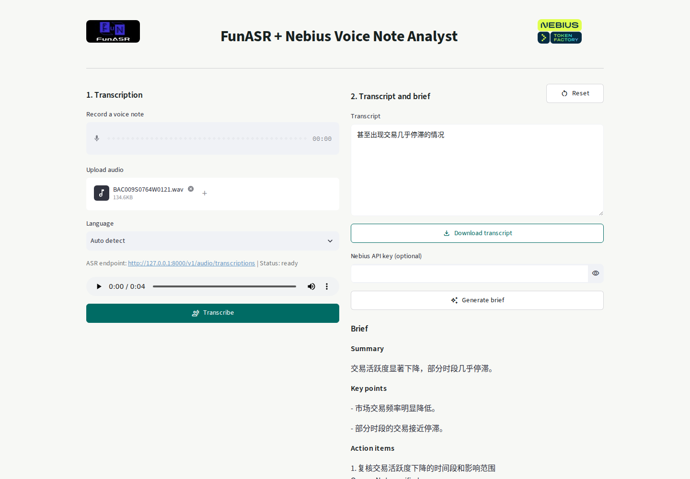

# FunASR + Nebius Voice Note Analyst

Turn multilingual recordings into an editable transcript, then optionally create a structured voice-note brief with Nebius Token Factory.

## Workflow

1. Record or upload audio in the Streamlit app.
2. The app sends the audio to a separately hosted [FunASR](https://github.com/modelscope/FunASR) OpenAI-compatible transcription endpoint.
3. Review and edit the transcript. This stage works without a Nebius API key.
4. Optionally send the edited transcript to [Nebius Token Factory](https://tokenfactory.nebius.com/) for a same-language summary, key points, action items, and follow-up message.

Audio is sent only to the configured FunASR endpoint. The transcript is sent to Nebius only after **Generate brief** is selected.

## Prerequisites

- Python 3.10 or newer
- A separately running FunASR OpenAI-compatible server
- A Nebius Token Factory API key only if brief generation is needed

SenseVoiceSmall supports Chinese, Cantonese, English, Japanese, and Korean. SenseVoiceSmall alone does not provide speaker diarization, and this app does not claim or simulate it.

## Start FunASR

From the `examples/openai_api` directory in a FunASR checkout:

```bash
pip install funasr==1.3.14 fastapi uvicorn python-multipart
python server.py --model sensevoice --device cuda --port 8000
```

The canonical server exposes `POST /v1/audio/transcriptions`. Use `--device cpu` when CUDA is unavailable.

For remote deployments, place the FunASR server behind an authenticated TLS gateway and set `FUNASR_API_KEY` for that gateway. Keep the Streamlit app private or protect it with access control; do not expose provider keys in URLs, source files, or browser-visible configuration.

## Install And Run

```bash
cd voice_agents/funasr_nebius_voice_note_analyst
uv sync --all-groups
cp .env.example .env
uv run streamlit run app.py
```

Equivalent pip installation:

```bash
python -m venv .venv
source .venv/bin/activate
pip install -e .
streamlit run app.py
```

Open `http://localhost:8501`.

## Configuration

| Variable | Default | Purpose |
| --- | --- | --- |
| `FUNASR_BASE_URL` | `http://127.0.0.1:8000/v1` | FunASR host, `/v1` base, or full transcription endpoint |
| `FUNASR_MODEL` | `sensevoice` | Model name sent to the FunASR endpoint |
| `FUNASR_API_KEY` | empty | Optional Bearer token for a protected FunASR gateway |
| `FUNASR_TIMEOUT_SECONDS` | `120` | FunASR request timeout |
| `NEBIUS_API_KEY` | empty | Optional Nebius Token Factory key |
| `NEBIUS_BASE_URL` | `https://api.tokenfactory.nebius.com/v1` | Nebius OpenAI-compatible base URL |
| `NEBIUS_MODEL` | `Qwen/Qwen3-235B-A22B` | Nebius model used for brief generation |
| `NEBIUS_TIMEOUT_SECONDS` | `60` | Nebius request timeout |

Provider URLs must be absolute HTTP(S) URLs without credentials, query strings, or fragments. Keys belong in environment variables or the password field, never in a URL.

## Project Structure

```text
funasr_nebius_voice_note_analyst/
|-- app.py
|-- assets/
|-- tests/
|-- voice_note_analyst/
|   |-- clients.py
|   |-- models.py
|   `-- settings.py
|-- .env.example
|-- pyproject.toml
`-- README.md
```

## Tests

```bash
uv run pytest tests -q
uv run ruff check .
uv run ruff format --check .
```

The suite covers settings validation, FunASR multipart and error contracts, Nebius structured output parsing, secret-safe failures, and the stateful Streamlit transcription, editing, analysis, audio-change, and reset flows. Real endpoint validation uses FunASR 1.3.14 with SenseVoice on an NVIDIA H100.

## References

- [FunASR](https://github.com/modelscope/FunASR)
- [SenseVoice](https://github.com/FunAudioLLM/SenseVoice)
- [Nebius Token Factory](https://tokenfactory.nebius.com/)
- [Requested FunASR demo: issue #219](https://github.com/Arindam200/awesome-ai-apps/issues/219)
